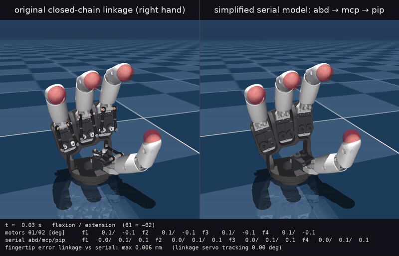

# HandDiffSim

> A differentiable simulator of a servo-driven robot hand, and the hinge-joint model it runs on

*Part of [Dynamics-Modeling](https://github.com/Frank-ZY-Dou/Dynamics-Modeling), research code and projects by [Frank Zhiyang Dou](https://frank-zy-dou.github.io/) from [MIT CDFG](https://cdfg.mit.edu/).*

HandDiffSim takes the Pollen Robotics [AmazingHand](https://github.com/pollen-robotics/AmazingHand), an
open-source hand whose fingers are driven by two servos through a parallel linkage, and does three things with
it. It replaces the closed-chain finger mechanism with three hinge joints per finger, identified from the
original model so that the two agree to a tenth of a millimetre at the fingertips. It wraps that simplified
hand as a differentiable simulator on MuJoCo Warp, a batched control step that PyTorch can backpropagate
through, torque in and pose out. And it uses the gradients: inverse kinematics solved through the dynamics,
a recorded motion followed by refining the commands through the simulator, and a torque model learned from
recordings the way NeuralActuator does it for robot arms.

| Simplified hand | Inverse kinematics through the simulator |
| :-: | :-: |
|  |  |
| **Following a reference motion** | **Learned torque surrogate** |
|  |  |

Top left: the original linkage (left) and the hinge-joint version (right) under the same servo commands; the
fingertips never differ by more than 0.11 mm. Top right: joint torques found by gradient descent through
MuJoCo Warp, then applied from rest to bring the fingertips to their targets. Bottom left: a recorded motion
(left), the simplified hand under frame-by-frame kinematic IK commands (middle) and under commands refined
through the simulator (right), 0.073 mm to 0.020 mm mean fingertip error. Bottom right: a held-out recording
of a hand that behaves differently from the model (left) and the simplified hand driven open loop for 8 s by a
Transformer trained through the simulator (right).

## Table of contents

- [Overview](#overview)
  - [1. Simplified hand](#1-simplified-hand) · [2. Differentiable simulation on MuJoCo Warp](#2-differentiable-simulation-on-mujoco-warp) · [3. Inverse kinematics through the simulator](#3-inverse-kinematics-through-the-simulator) · [4. Following a reference motion](#4-following-a-reference-motion) · [5. Learning a torque surrogate](#5-learning-a-torque-surrogate)
- [Repository layout](#repository-layout)
- [Getting started](#getting-started)
  - [Setup](#setup) · [Running the upstream demos](#running-the-upstream-demos) · [Using the simplified hand](#using-the-simplified-hand) · [Running the differentiable simulation](#running-the-differentiable-simulation)
- [The hand](#the-hand)
- [Simplified hand: identification and validation](#simplified-hand-identification-and-validation)
- [Differentiable simulation: design and results](#differentiable-simulation-design-and-results)
- [Limitations](#limitations)
- [License](#license)

## Overview

### 1. Simplified hand

Each finger of the AmazingHand is a parallel linkage: two servos, two ball-jointed rods, a four-bar that folds
the fingertip along with the finger. The upstream MuJoCo model reproduces it exactly, with 20 loop-closing
constraints. `serial_hand/` replaces it with three hinges per finger (sideways, knuckle, fingertip), the
fingertip hinge tied to the knuckle by an identified polynomial, and an exact closed-form mapping between servo
angles and joint angles in both directions. Everything is identified from the upstream model by sampling its
motion; the fingertips of the two models agree to 0.08 mm from the servo angles, and the simplified model runs
under the upstream inverse-kinematics demo unchanged.

### 2. Differentiable simulation on MuJoCo Warp

`diffsim/` wraps the simplified hand as a batched control step on MuJoCo Warp that is a PyTorch autograd
function: torque in and pose out (or servo targets in), ten substeps per call, B worlds at once. MuJoCo Warp
ships no adjoint kernels, so the backward pass evaluates the step Jacobian by central differences on B x 65
worlds in one batched call, which costs 4 ms with CUDA graphs. The gradients are checked against finite
differences of a whole rollout loss and against a float64 reference.

### 3. Inverse kinematics through the simulator

Fingertip targets solved by gradient descent through the simulation, with joint torques over a horizon or
servo commands as the unknowns and twelve random starts running as one batch: 0.05 mm mean fingertip error.
Inputs are parametrized inside their bounds because a saturated input has a zero finite-difference gradient.

### 4. Following a reference motion

A recorded fingertip motion of the original hand, played twice as fast, followed by the simplified hand.
Frame-by-frame kinematic inverse kinematics gives commands that lag by 0.073 mm on average; refining the
command sequence through the simulator (multiple shooting on batched windows) brings the simulated fingertips
to 0.020 mm of the reference.

### 5. Learning a torque surrogate

The NeuralActuator recipe applied to the hand: a network maps a window of commands and joint states to the
eight joint torques, the simulator advances the hand, and the joint-angle error against recordings is
backpropagated through the simulator into the network. Recordings come from the original linkage model for
now, in a nominal version and one with weaker servos and extra friction; MLP and Transformer surrogates are
evaluated open loop over 8 s against a physics-only baseline. On the mismatched recordings the Transformer
brings the error from 0.63° to 0.39°; on the nominal ones the baseline is already within 0.22°.

## Repository layout

    AmazingHand/     the upstream repository, included as a git submodule and not modified
    serial_hand/     the simplified hand: model files, the code that built and checked them, figures, videos
    diffsim/         the simplified hand on MuJoCo Warp with gradients, and a trainer for a torque surrogate
    tools/           scripts that exercise the upstream simulation on a machine without a display
    docs/media/      the clips above, full-resolution videos included
    LICENSE          MIT

## Getting started

Clone with the submodule; the simplified hand loads its meshes from the upstream folder. Everything below is
run from this folder.

    git clone --recurse-submodules git@github.com:Frank-ZY-Dou/Dynamics-Modeling.git
    cd Dynamics-Modeling/HandDiffSim

### Setup

The upstream demos are built around `uv`, a Python 3.12 virtual environment and the `dora` dataflow tool.
Follow `AmazingHand/Demo/README.md`, or:

    cd AmazingHand/Demo
    uv venv --python 3.12
    source .venv/bin/activate
    uv pip install "dora-rs-cli==0.3.13" rustypot
    dora build dataflow_angle_simu.yml --uv
    dora build dataflow_tracking_simu.yml --uv

Two versions are fixed on purpose. The upstream projects only accept `dora-rs` up to 0.3.13, so the command-line
tool has to be 0.3.13 as well. The hand-tracking demo needs `mediapipe` 0.10.15 or older, which is why Python
3.12 is used rather than a newer release. The scripts in `serial_hand/` and `tools/` use this same environment;
making the videos also needs a system `ffmpeg` with H.264 support.

### Running the upstream demos

    cd AmazingHand/Demo && source .venv/bin/activate
    dora run dataflow_angle_simu.yml --uv        # both hands follow a sine-wave finger pattern
    dora run dataflow_tracking_simu.yml --uv     # a webcam tracks your hand and drives the simulated hands

Both open a MuJoCo window, so they need a display. On a machine without one, everything in this folder renders
to image files instead, with `MUJOCO_GL=egl`. Two scripts in `tools/` check the upstream simulation without a
window: `check_sim_headless.py` loads the model, runs the same
inverse-kinematics solver as the demo and writes PNG frames; `dataflow_angle_simu_headless.yml` runs the real
dora dataflow with the viewer switched off.

    source AmazingHand/Demo/.venv/bin/activate
    MUJOCO_GL=egl python tools/check_sim_headless.py --side both --seconds 1.0
    timeout -s INT 40 dora run tools/dataflow_angle_simu_headless.yml

The Rust motor-control node (`AHControl`) is only needed to drive a physical hand and is not part of this setup;
the upstream README covers it. The Python examples in `AmazingHand/PythonExample/` work with the environment
above once a hand is attached; they default to the Windows port `COM11`, so change that to `/dev/ttyACM0` on
Linux.

### Using the simplified hand

The generated files are committed, so rebuilding is optional. To rebuild, compare or record:

    cd serial_hand && source ../AmazingHand/Demo/.venv/bin/activate && export MUJOCO_GL=egl
    python build_serial_model.py --side both     # about 70 s per hand; writes models/ and params/
    python compare_motion.py --side both         # figures/ and renders/
    python make_video.py --side right            # video/linkage_vs_serial_right.mp4

Load `serial_hand/models/AH_Right/scene.xml` (or `AH_Left`) like any other MuJoCo model. The joints are named
`f1_abd`, `f1_mcp`, `f1_pip` and so on for fingers 1 to 4: `abd` moves the finger sideways, `mcp` bends it at the
knuckle, `pip` bends the fingertip and is tied to `mcp` by a built-in constraint. There are eight position
actuators, `f{n}_abd` and `f{n}_mcp`, with the same gain as the upstream servos. The scene keeps the upstream
floor, lights and the four fingertip target markers, so the upstream demo node `mj_mink_right.py` runs on it
after changing the model path.

To convert between servo angles and joint angles from Python:

    from ah_serial.kinematics import SerialHandKinematics
    K = SerialHandKinematics.from_json("params/identified_right.json")
    q = K.motors_to_joints(theta8)          # 8 servo angles, order f1_motor1, f1_motor2, ..., f4_motor2 -> (4, 3) [abd, mcp, pip]
    theta8 = K.joints_to_motors(q[:, :2])   # back to servo angles, exact, ready to send to the real hand
    qpos = K.qpos_from_motors(theta8)       # the qpos vector of the simplified model
    K.in_motor_workspace(q[:, :2])          # can each finger reach this target within ±90° of servo travel?

Angles are in radians throughout. Positive `mcp` bends the finger towards the palm; positive `abd` moves the
fingertip towards the thumb (towards the index finger in the case of the thumb).

### Running the differentiable simulation

    cd HandDiffSim && source AmazingHand/Demo/.venv/bin/activate && export MUJOCO_GL=egl
    python -m diffsim.tests.test_backend                                 # parity and gradient checks
    python -m diffsim.examples.ik_through_sim --mode torque command kinematic
    python -m diffsim.examples.track_reference --steps 200 --window 25 --speed 2
    python -m diffsim.synth_data --side right --n-train 12 --n-val 4
    python -m diffsim.train_actuator --config diffsim/configs/hand_mlp.yaml
    python -m diffsim.evaluate --ckpt diffsim/outputs/mlp/ckpt_final.pt
    python -m diffsim.make_videos ik|track|rollout

Needs `mujoco-warp==3.12.0`, `warp-lang==1.17.0` and a CUDA build of `torch` in the venv, and `ffmpeg` for
the videos.

## The hand

Each finger of the AmazingHand is moved by two small servos. Each servo turns a short crank, and a rod with a
ball joint at either end links the crank to the base of the finger, which sits on a two-axis pivot. Turning the
two servos the same way bends the finger; turning them in opposite directions moves it sideways. A second small
linkage bends the fingertip along with the rest of the finger. The upstream MuJoCo model reproduces all of this
exactly, which means 20 loop-closing constraints, 12 ball joints and 20 hinges for eight driven degrees of
freedom.

That is the right model for studying the mechanism and an awkward one for anything that wants an ordinary joint
tree: motion planning, reinforcement learning, retargeting human hand poses. The simplified hand has three hinges
per finger (sideways, knuckle, fingertip), the fingertip hinge follows the knuckle automatically, and a small
amount of code converts between servo angles and joint angles in both directions. Its motion matches the
original to a few hundredths of a millimetre.

The top-left clip above shows the original model, with its cranks, rods and coupling links, next to the
simplified model driven by the same servo commands; over the whole clip the fingertip positions of the two never
differ by more than 0.11 mm. Full-resolution videos: [right hand](docs/media/linkage_vs_serial_right.mp4),
[left hand](docs/media/linkage_vs_serial_left.mp4). The same comparison at six fixed poses:
[compare_right.png](serial_hand/renders/compare_right.png).

## Simplified hand: identification and validation

`serial_hand/build_serial_model.py` does the following for each hand. It loads the upstream model, finds the
parts of each finger by their joint names, and reads off the hinge axes and the fingertip position at the zero
pose. It then commands the upstream servos to every pair of angles on a 5° grid, 1369 pairs in all, lets the
mechanism settle each time with gravity and joint friction switched off, and records where every part ended up.
From those poses it works out the three hinge angles that reproduce each one. The part of the motion that a
hinge cannot account for never exceeds 0.005°, which is what shows that three hinges are enough. Finally it fits
the fingertip-to-knuckle coupling with a fourth-order polynomial, fits the servo-to-joint map, writes the model
file, and compares the two models pose by pose.

The servo-to-joint conversion uses the actual crank-and-rod geometry, so it is exact rather than fitted: given
the joint angles, each rod fixes its servo angle through a single trigonometric equation, and the reverse
direction is a two-variable Newton iteration started from a polynomial guess. The naming of the upstream parts,
the identified numbers and the checks are described in [serial_hand/README.md](serial_hand/README.md).

Measured over all valid samples of the right hand; the left hand gives the same numbers.

| joint angles obtained from | fingertip position error, rms / max | fingertip orientation error, rms / max |
|---|---|---|
| the upstream model directly | 0.002 / 0.008 mm | 0.001° / 0.005° |
| servo angles, exact conversion | 0.011 / 0.08 mm | 0.017° / 0.10° |
| servo angles, polynomial only | 0.095 / 0.51 mm | 0.09° / 0.48° |

Identified ranges and couplings:

| | |
|---|---|
| joint ranges reachable within ±90° of servo travel | sideways ±38.7°, knuckle −61.6° to +44.2°, fingertip −63.6° to +37.6° |
| fingertip coupling polynomial | residual 0.016° rms, 0.08° max |
| a linear approximation (bend ∝ θ1 − θ2, sideways ∝ θ1 + θ2) | 3.6° rms error, so the real relation is clearly nonlinear |
| crank dead centre, the point where rod and crank line up and the crank cannot push the finger any further | reached between 87° and 90° of servo travel; it limits extension, the servo range limits flexion |

The simplified model also behaves under dynamics: with position servos on the two driven joints, the fingertip
coupling error stays at 0.000°. The upstream inverse-kinematics demo runs on it unchanged.

## Differentiable simulation: design and results

### The simulator step

`HandWarpBackend.step(qpos, qvel, ctrl, xfrc)` advances B copies of the simplified hand by one control period
(ten MuJoCo Warp substeps of 2 ms) and is a `torch.autograd.Function`, so a rollout can be differentiated with
ordinary PyTorch code. In torque mode `ctrl` is the joint torque on the eight driven hinges and the output is
the pose, torque in and pose out; in position mode `ctrl` is the target of the model's own servos. MuJoCo Warp
compiles without adjoint kernels (forcing them on gives all-zero gradients, the experiment is in
`diffsim/tests/tape_experiment.py`), so the backward pass runs the same step on B x 65 worlds with every input
perturbed and forms the step Jacobian by central differences on the GPU; with CUDA graphs that costs 4 ms for
the 1040 worlds of a batch of 16. The gradients agree with finite differences of a whole rollout loss to
0.1 % and with a float64 plain-MuJoCo reference to cos = 1.00000.

### Inverse kinematics through the simulator

Four fingertip targets, solved by gradient descent through the simulation (`diffsim/examples/ik_through_sim.py`).
The unknowns are the joint torques at each of 30 control steps; twelve random starts run as one batch and the
best start per finger is kept. The clip shows the pose at the end of the horizon while the optimization runs,
then the optimized torques played from rest at one fifth of real time; the translucent spheres are the targets.
Mean fingertip error 0.05 mm (0.05 mm with servo commands as the unknowns, 0.00 mm for a purely kinematic
solve). Two details were needed: commands and torques are parametrized inside their bounds, because a
saturated input has a zero finite-difference gradient, and the parallel starts cover the local minima that a
single start from the zero pose falls into.

### Following a reference motion

A recorded fingertip motion of the original hand, played twice as fast, followed by the simplified hand
(`diffsim/examples/track_reference.py`). Left: the recording replayed on the original linkage. Middle: the
simplified hand under commands from frame-by-frame kinematic inverse kinematics. Right: the same commands
refined by gradient descent through the simulator so that the simulated fingertips, not just the commanded
joint angles, follow the reference; the red spheres are the reference fingertip positions at each instant.
The refinement runs as multiple shooting on batched windows and ends with a short sequential stage.

| commands | fingertip tracking error, mean | max |
|---|---|---|
| kinematic IK, frame by frame | 0.073 mm | 1.24 mm |
| refined through the simulator | 0.020 mm | 0.49 mm |

### Learning a torque surrogate

The NeuralActuator recipe on the hand: a network maps a window of commands and joint states to the eight
joint torques, the backend advances the simplified hand, and the joint-angle error against recorded
trajectories is backpropagated through the simulator into the network. Recordings come from the original
linkage model for now (`diffsim/synth_data.py`, gravity, upstream friction and servos), in a nominal version and
one with weaker servos and extra friction that stands in for a hand behaving less like the model. The clip
shows a held-out recording of the mismatched hand on the left and the simplified hand driven open loop for 8 s
by the trained Transformer on the right. Joint-angle MAE over four held-out recordings:

| recordings | physics-only baseline (model servos) | MLP surrogate | Transformer surrogate |
|---|---|---|---|
| nominal linkage | 0.220° | 0.472° | 0.286° |
| mismatched linkage (servo kp 25, extra friction) | 0.625° | 0.544° | 0.386° |

On the nominal recordings the simplified hand with its nominal servos is already within 0.22° and there is
nothing for a surrogate to learn; on the mismatched ones the surrogate recovers part of the gap. The pipeline is
meant for recordings from the physical hand, which drop in without changes.

Design details, the failed adjoint experiment, and all commands are in [diffsim/README.md](diffsim/README.md).

## Limitations

Only the geometry and the joint relations were matched. The three kept bodies carry the upstream inertial
values, the few grams of rods and cranks are ignored, and servo dynamics were not looked at. Like the upstream
model it has no collision geometry, so grasping needs contact shapes added first. The joint ranges above are
the bounding box of the reachable region, not the region itself; `in_motor_workspace` tells whether a target is
actually reachable. Past the crank dead centre two servo angles give the same finger pose; the simplified model
represents only the side that continues from the zero pose.

## License

The code in this folder is released under the MIT License (see `LICENSE`). The AmazingHand itself is by Pollen
Robotics: its code is Apache-2.0 and its mechanical design CC-BY-4.0, and the meshes used here come from that
repository.
