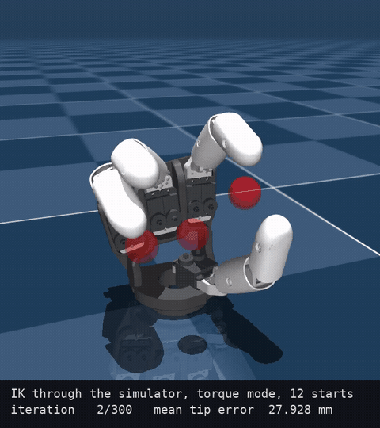
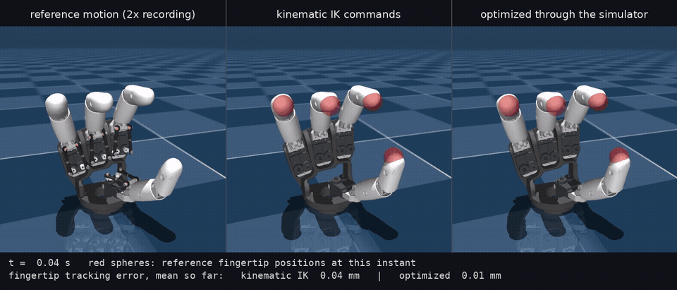
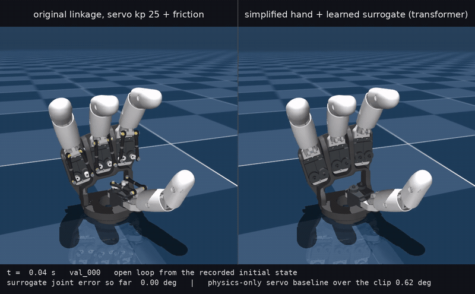

# diffsim: the simplified hand on MuJoCo Warp, with gradients

This directory makes the simplified AmazingHand (`../serial_hand`) usable as a differentiable simulator, following
the structure of the NeuralActuator code (Dynamics-Modeling/NeuralActuator): a batched, stateless control step
with a backward pass, a torque-surrogate network, and a trainer that backpropagates pose error through the
simulator. The simulator is MuJoCo Warp (`mujoco_warp` 3.12) on the GPU; everything else is PyTorch.

    backend.py            HandWarpBackend.step(qpos, qvel, ctrl, xfrc) as a torch.autograd.Function
    kinematics_torch.py   fingertip forward kinematics in torch, from the identified geometry
    servo.py              position-servo torque law tau = kp (cmd - q) - kd v, and its inverse cmd(tau, q, v)
    models.py             torque surrogates: MLP (NeuralActuator TorqueNet layout) and a gated Transformer
    synth_data.py         reference trajectories recorded from the original linkage model
    data.py               trajectory loading, features, rollout windows
    train_actuator.py     training loop (curriculum, AdamW + warm-up/cosine, clipping, non-finite skipping, EMA)
    evaluate.py           open-loop rollouts on held-out trajectories against a position-servo baseline
    examples/ik_through_sim.py   inverse kinematics by gradient descent through the simulator
    examples/track_reference.py  following a recorded fingertip motion: kinematic IK vs commands optimized through the simulator
    make_videos.py               the videos below (committed copies live in ../docs/media)
    tests/test_backend.py        forward parity, determinism, gradient checks, FK parity
    tests/tape_experiment.py     the failed attempt at a Warp tape through mujoco_warp (see below)
    tests/bench_step.py          step time versus world count
    configs/                     training configs

## Videos

`docs/media/ik_through_sim.mp4`: the torque-mode inverse kinematics of `examples/ik_through_sim.py`. First the pose
at the end of the horizon of the best of 12 parallel starts, iteration by iteration, then the optimized torque
sequence played from rest at one fifth of real time; the translucent spheres are the targets.

`docs/media/track_reference.mp4`: following a recorded fingertip motion (`examples/track_reference.py`). Left, the
recording played twice as fast by the original linkage; middle, the simplified hand under commands from
frame-by-frame kinematic inverse kinematics; right, under the same commands refined through the simulator.
The red spheres mark the reference fingertip positions at each instant.

`docs/media/surrogate_rollout_transformer_kp25.mp4`: a held-out recording from the mismatched reference hand (left,
the original linkage with servo gain 25 and extra friction, replaying the recorded commands) next to the
simplified hand driven open loop for the whole 8 s by the Transformer surrogate trained on that data (right).

## The simulator step

`HandWarpBackend(batch_size, data_dt, n_sub)` holds two MuJoCo Warp `Data` objects built from
`serial_hand/models/AH_<side>/serial_hand.xml`: one with B worlds for the forward pass and one with
B x (1 + 2 n_in) worlds for the backward pass. A call

    qpos_next, qvel_next = backend.step(qpos, qvel, ctrl, xfrc=None)    # (B,12), (B,12), (B,8), (B,4,3)

advances every world by `n_sub` MuJoCo substeps (the model timestep is `data_dt / n_sub`). In torque mode
`ctrl` is the joint torque on the eight driven hinges (abd and mcp of each finger), applied through
`qfrc_applied`; the model's own position servos are silenced. In position mode `ctrl` is the servo target and
the XML actuators (kp = 50, as upstream) produce the torque. `xfrc` is an optional world-frame force at each
fingertip. The fingertip coupling `pip = f(mcp)` is the joint equality of the model and is solved by MuJoCo
Warp like any other constraint; contacts are disabled.

### Why the gradients are finite differences

MuJoCo Warp compiles all of its kernels with `enable_backward: False`, so a Warp tape cannot run adjoints
through `mjw.step`. Forcing the option on for all 32 of its modules was tried (`tests/tape_experiment.py`): the forward runs
under the tape and `tape.backward()` executes, but every gradient comes back zero, because the internal `Data` arrays are allocated without gradient storage and the constraint solver
updates its iterates in place. Rewriting those kernels is out of scope, and the NeuralActuator Newton backend
avoided the same problem by using Newton's Featherstone solver instead of MuJoCo's.

The backend therefore computes the step Jacobian numerically, using the one thing MuJoCo Warp is good at:
many worlds at once. In the backward pass the same step is run on `B x (1 + 2 n_in)` worlds with every input
perturbed by +-h (n_in = 12 + 12 + 8 = 32 by default, 44 with fingertip forces), the Jacobians of
`(qpos_next, qvel_next)` with respect to `(qpos, qvel, ctrl)` follow from central differences on the GPU, and
the vector-Jacobian products are one batched matmul. For this smooth, contact-free hand the truncation error
is O(h^2); the checks in `tests/test_backend.py` compare the result with finite differences of a whole rollout
loss and with component-wise differences of a float64 plain-MuJoCo reference. Both passes are captured as
CUDA graphs after one warm-up call; on an RTX 2080 Ti a control step of 10 substeps costs about
2.9 ms for 16 worlds and 4.1 ms for the 1040 worlds of the Jacobian batch, against 48 ms without graphs.

What this is not: an analytic adjoint. If MuJoCo Warp ships backward kernels later, the class can switch its
`_backward_raw` to a tape without changing the interface.

## Reference data

Until the physical hand is on the bench, `synth_data.py` produces the recordings the trainer needs from the
original closed-chain model, which is as close to the real hand as the simulation gets: gravity on, the
upstream joint friction, the upstream position servos with kp = 50. Randomized command programs (held targets
with smooth transitions plus slow sinusoids, more flexion than extension, sideways motion mixed in) drive the
eight servos at 50 Hz for 8 s. Each `data/<side>/*.npz` holds the commanded and reached servo angles, the
equivalent hinge angles of the simplified hand (extracted from the body orientations exactly as in
`serial_hand`), the fingertip positions and the joint-space equivalent of the command from the closure model.

The recordings differ from the simplified hand only through the linkage's friction, its servo dynamics and the
nonlinear transmission, none of which is in the simplified model. The mismatched variant (`--servo-kp 25
--motor-friction 0.05`) exists because those differences turn out to be small: it stands in for a hand that
behaves less like the model than the nominal recordings do.

## Torque in, pose out

The default mode of the backend is torque-driven: `ctrl` holds the eight joint torques, applied through
`qfrc_applied` at every substep while the model's own servos are switched off, and the returned state is the
pose (and velocity) after one control period. That is the interface a torque surrogate needs, and it is what
`tests/test_backend.py` checks against plain MuJoCo (max 1.2e-7 rad after 10 substeps) and differentiates
(the gradient of a 6-step rollout loss agrees with finite differences to 0.1 % in every input, and with a
component-wise float64 reference to cos = 1.00000). Position mode keeps the XML servos and takes the servo
targets as `ctrl` instead; both are used below.

## Inverse kinematics through the simulator

`examples/ik_through_sim.py` poses a fingertip-placement problem and solves it by gradient descent through the
simulator. The targets come from a known joint configuration, so joint angles can be checked as well as
fingertip distances. Three formulations share the loss (squared fingertip distance) and the optimizer (Adam
with a cosine schedule):

- torque: the unknowns are the joint torques at each of 30 control steps (0.6 s); the hand starts at rest and
  the loss counts the last five steps, plus small effort and terminal-velocity terms. This is the torque-to-pose
  direction used as an optimization.
- command: the unknowns are eight constant servo targets; the XML servos act inside MuJoCo Warp.
- kinematic: the unknowns are the joint angles themselves, torch forward kinematics only, as a reference.

Two details made the sim-based modes work. Saturation kills gradients: once a servo command leaves the
actuator's control range, or a torque hits its bound, the pose no longer responds to that parameter and its
finite-difference gradient is exactly zero, so commands are parametrized as `lo + (hi - lo) sigmoid(z)` and
torques as `tau_max tanh(z)`, and the torque mode penalizes approaching a joint limit. Local minima remain, so
both modes run several random starts in parallel, one world each, and keep per finger the start with the
smallest fingertip error; the assembled solution is re-simulated once before its error is reported.

With 12 parallel starts (one run, RTX 2080 Ti):

| mode | mean fingertip error | worst finger | max joint error | starts within 1 mm, per finger | time |
|---|---|---|---|---|---|
| torque (30 steps x 8 torques) | 0.05 mm | 0.08 mm | 0.6° | 58 %, 58 %, 75 %, 100 % | 101 s |
| command (8 servo targets) | 0.05 mm | 0.18 mm | 0.1° | 100 %, 17 %, 25 %, 100 % | 68 s |
| kinematic (8 joint angles) | 0.00 mm | 0.00 mm | 0.0° | single start | 22 s |

The kinematic solve converges to 1e-5 mm; the sim-based ones level off around 0.1 mm, which is the resolution
of a float32 simulation differentiated by finite differences. `outputs/ik/ik_curves.png` has the convergence
curves, `outputs/ik/ik_pose_<mode>.png` the final pose with the target markers.

## Following a reference motion

`examples/track_reference.py` takes a recorded fingertip motion of the original hand as the reference and makes
the simplified hand follow it. Kinematic inverse kinematics solves every frame on its own (torch forward
kinematics, all frames as one batch) and gives the joint angles that place the fingertips on the reference at
each instant. Sent to a hand with servo dynamics, such commands lag behind the motion, so in a second stage the
whole command sequence is refined by gradient descent through the simulator: the loss is the distance between
the *simulated* fingertip trajectory and the reference, plus a small smoothness term on the commands. The
optimization uses multiple shooting, windows of 25 steps that start from the recorded state and run as one
batch, and the numbers below come from a single sequential open-loop rollout of the stitched commands.

Numbers for a 4 s segment of a held-out recording played back twice as fast (200 steps at 50 Hz, window 25,
120 windowed and 20 sequential iterations, about 3.5 minutes in total):

| commands | fingertip tracking error, mean | max |
|---|---|---|
| kinematic IK, frame by frame | 0.073 mm | 1.24 mm |
| refined through the simulator | 0.020 mm | 0.49 mm |

The kinematic fit itself is 0.012 mm, so the residual of the first row is the servo lag and the refinement
removes most of it. Both are small because the model's servos are stiff for such light fingers; at four times
the recording speed (`--speed 4 --steps 100`) the frame-by-frame commands leave 0.136 mm and the refined ones
0.025 mm. `outputs/track/track_curves.png` shows the
error over time and the knuckle angle of finger 1 against the reference; the refined commands lead the motion
by a few milliseconds where it changes direction and are otherwise indistinguishable from it.

## Training a torque surrogate

    cd HandDiffSim
    source AmazingHand/Demo/.venv/bin/activate
    python -m diffsim.synth_data --side right --n-train 12 --n-val 4
    python -m diffsim.synth_data --side right --n-train 12 --n-val 4 --servo-kp 25 --motor-friction 0.05 --tag _kp25
    python -m diffsim.tests.test_backend
    python -m diffsim.train_actuator --config diffsim/configs/hand_mlp.yaml
    python -m diffsim.evaluate --ckpt diffsim/outputs/mlp/ckpt_final.pt

The network sees a window of H = 8 past feature vectors plus the current one; a feature vector is the
joint-space command, the driven joint angles and velocities, the command error and the raw servo command
(40 numbers). It outputs eight joint torques, clamped to +-2 N m and held for the 20 ms control period; the
backend advances the simplified hand; the loss is a smooth L1 on the driven joint angles against the
recording, summed over the rollout. Rollout length grows through a curriculum (12, 24, 48 steps). A training
step at batch 16 and 48 rollout steps takes about 0.35 s on the RTX 2080 Ti; the runs below took 3 to 6
minutes each.

At evaluation the surrogate drives the simulated hand open loop over whole 8 s held-out recordings, from the
recorded initial state, and is compared with the physics-only alternative: the simplified hand with its own
position servos (kp = 50, updated every 2 ms) tracking the joint-space command.

| reference recordings | physics-only baseline | MLP surrogate | Transformer surrogate |
|---|---|---|---|
| nominal linkage (servo kp = 50, upstream friction) | 0.220° | 0.472° | 0.286° |
| mismatched linkage (servo kp = 25, +0.05 N m motor friction) | 0.625° | 0.544° | 0.386° |

Joint-angle MAE over four validation trajectories, eight driven joints. On the nominal recordings the
simplified hand with its nominal servos already reproduces the linkage to 0.22°, and a surrogate that has to
hold its torque for 20 ms cannot beat a servo loop running at 2 ms; there is nothing for it to learn there.
When the recorded hand behaves differently from the model, the baseline degrades to 0.63° and the surrogate
recovers part of the gap (0.39° with the Transformer). Real servo telemetry is the case the method is meant
for, and this is the pipeline it will run through unchanged. `outputs/<run>/eval_rollout.png` shows one held-out
trajectory for each run.

## Environment

The environment of the Setup section of the main README plus `mujoco-warp==3.12.0`, `warp-lang==1.17.0` and `torch` (cu124 build).
Warp 1.17 works with a CUDA 12.4 driver. `MUJOCO_GL=egl` is needed only for
rendering; the backend itself does not render.
