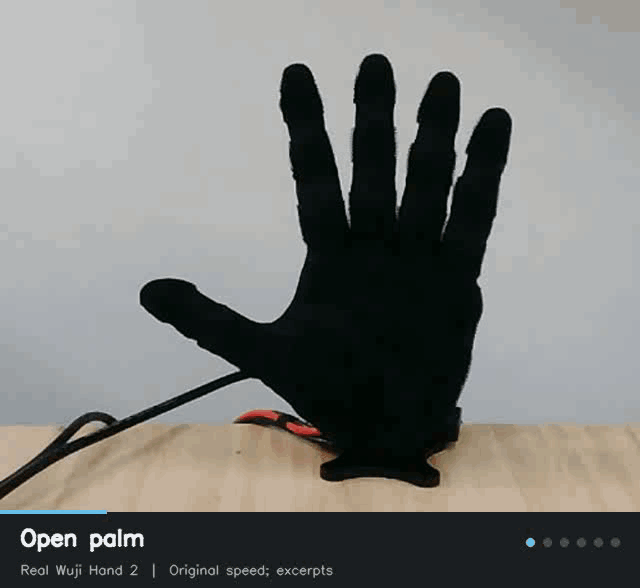

<h1 align="center">Wuji2 Control</h1>

<p align="center">
  Communication, joint control, and gesture examples for Wuji Hand 2.
</p>

<p align="center">
  
</p>

<p align="center">
  Open palm · Pointing · Peace · Thumbs up · I love you · Shaka<br>
  Real hardware, shown as original-speed excerpts.<br>
  <a href="docs/media/wuji2_gestures.mp4">Video</a> ·
  <a href="#installation">Install</a> ·
  <a href="#run-gestures">Run gestures</a> ·
  <a href="docs/control.md">Control design</a>
</p>

Python communication and joint control for Wuji Hand 2 Beta 2. The package
provides device inspection, six gesture poses, bounded motion, camera recording,
and video export. Connection settings are supplied by the caller.

The current gesture set is for the **left hand**: open palm, pointing, peace,
thumbs up, I love you, and shaka. The SDK driver checks device type and handedness;
right-hand gesture targets have not been validated.

## Installation

Python 3.10 or newer is required. Hardware communication uses the official
[Wuji SDK](https://github.com/wuji-technology/wuji-sdk). The supported SDK version
is pinned separately from the model and camera dependencies.

```sh
cd Hand_Robot_Control/wuji2
python -m venv .venv
. .venv/bin/activate
python -m pip install -e '.[hardware,model,camera]'
wuji2 gestures
```

For development without hardware:

```sh
python -m pip install -e '.[dev,model,camera]'
python -m pytest
ruff check src tests examples
```

The base package imports without loading the SDK, MuJoCo, or OpenCV. Device
connections and camera acquisition begin only when their respective operations
are called. Ethernet setup is managed outside this package; the computer and
hand must be reachable on the same network. See the manufacturer's
[connection instructions](https://docs.wuji.tech/docs/en/wuji-hand/latest/sdk-reference/#connection).

## Model files

Gesture execution requires the official MJCF model for the selected hand. Meshes
are loaded from the upstream model directory; they are not bundled in this package.
The reference revision is `c2cd7f8d1ef8b6dc8cb907c17daa5a88b4442d95`.

```sh
git clone --filter=blob:none --sparse https://github.com/wuji-technology/wuji-description.git external/wuji-description
git -C external/wuji-description sparse-checkout set hand2/hand2_beta2/body
git -C external/wuji-description checkout c2cd7f8d1ef8b6dc8cb907c17daa5a88b4442d95
```

The commands below use
`external/wuji-description/hand2/hand2_beta2/body/mjcf/left.xml`.
The fixed-base `left_with_mount.xml` variant is also accepted. A model with
unexpected joints, joint types, or handedness is rejected.

## Inspect and check

These commands do not enable motors:

```sh
wuji2 discover
wuji2 inspect --serial YOUR_HAND_SERIAL --handedness left
wuji2 check all --model external/wuji-description/hand2/hand2_beta2/body/mjcf/left.xml
```

Use `--address HOST:PORT` instead of `--serial` when connecting by endpoint. There
is no automatic selection of the first available device. `inspect` only reads
feedback and closes its own connection.

`check` samples the paths from open palm through the selected gestures and back,
checking joint ranges and self-collisions. Supply `--start-json start.json` to
also check a measured initial pose, stored as a JSON array of 20 angles.
Checks cover the supplied hand model; nearby objects and people are not in it.

## Run gestures

`run` prints a checked plan by default. Add `--execute` to move the selected
hand. A working recording camera is required by this command. Keep the hand
supported and the workspace clear, and observe the camera during movement.

```sh
wuji2 run peace shaka \
  --model external/wuji-description/hand2/hand2_beta2/body/mjcf/left.xml

wuji2 run peace shaka --execute \
  --serial YOUR_HAND_SERIAL --handedness left \
  --camera /dev/video0 \
  --model external/wuji-description/hand2/hand2_beta2/body/mjcf/left.xml
```

Default settings are `kp=3`, `kd=0.05`, a 0.5 A current limit, and a peak commanded
speed of 0.2 rad/s. `--hold` controls gesture duration. The MCU temperature cutoff
is 60 °C by default and can be configured with `--max-temperature` within the
supported session range. These are application limits, separate from the device's
own protection settings. Full parameter definitions are in
[control.md](docs/control.md).

The controller reads the initial joint positions, checks the full sequence,
seeds the command with the measured pose, and then enables the motors. It returns
through open palm between gestures and disables at the end. Ctrl+C requests a
stop. Device faults, stale feedback, recording failures, excessive motion, and
controller heartbeat loss stop the session. Settings are restored only after
motor disable has been confirmed using fresh diagnostics.

## Recordings

Each executed run creates a separate directory under `recordings/`. A successful
run contains:

- `plan.json` and `result.json`: requested poses, configuration, and completion or error information.
- `telemetry.jsonl`: measured positions, commands, currents, and session stages.
- `camera.avi`, frame timestamps, and camera status: original camera frames and acquisition timing.
- Before/after images and the latest camera image.

Planning alone creates no recording. Interrupted or failed runs retain the
files produced before the failure; an after image may be absent.

The camera's actual frame rate may differ from the AVI header. Export using the
recorded timestamps to preserve elapsed time:

```sh
wuji2 export recordings/RUN_DIRECTORY gesture.mp4
```

Export requires `ffmpeg`, produces H.264 video, and refuses to replace an existing
output. Local recordings and environment files are ignored by Git.

## Python API

The same session implementation is used by the command line and Python examples.
See [examples/gesture.py](examples/gesture.py) for a complete recorded run and
[examples/inspect.py](examples/inspect.py) for read-only feedback.

| Module | Responsibility |
| --- | --- |
| `device.py` | Explicit SDK connection, node mapping, subscriptions, settings, and commands |
| `session.py` | Preflight, motion execution, monitoring, watchdog, verified stop and restoration |
| `config.py` | Connection and control configuration |
| `motion.py` | Immutable waypoints and smooth trajectories |
| `model.py` | SDK-to-model joint mapping, ranges, and sampled self-collision checks |
| `gestures.py` | Gesture targets and sequence construction |
| `recording.py` | Camera process, recording health, and measured-time export |

## Validation and maintenance

The six gesture targets were demonstrated on a left Beta 2 hand on 2026-09-17.
Recorded maximum joint errors at the gesture holds were 0.036–0.063 rad, and the
run ended with motors disabled. Those observations belong to the original
controller; this package reorganizes the communication and control code and adds
failure-path tests. The refactored controller has not been run on hardware as
part of this repository update. See [hardware notes](docs/hardware.md).

Tests cover device feedback, lifecycle failures, trajectories, model checks,
recording, and CLI behavior without a hand. To run the official-model checks:

```sh
WUJI2_MODEL_PATH="$PWD/external/wuji-description/hand2/hand2_beta2/body/mjcf/left.xml" python -m pytest
```

Changes to the SDK adapter should include tests for connection and cleanup.
Changes to joint ordering or gesture data should include model checks and a new
hardware observation report before they are described as hardware-tested.
The gesture module returns copies of targets so callers cannot modify the
shared pose definitions.

A [GitHub Actions configuration](ci/github-actions.yml) is provided for Python
3.10, 3.12, and 3.13. It installs the pinned reference model, runs lint and
offline tests, and builds the distribution. To enable it, copy the file to
`.github/workflows/hand-robot-control.yml` at the repository root and commit it
using credentials that permit workflow updates. The configuration is not active
while it remains in `ci/`.

## License and references

This package is MIT licensed; see [LICENSE](LICENSE). Wuji Technology maintains
the [SDK](https://github.com/wuji-technology/wuji-sdk) and
[model files](https://github.com/wuji-technology/wuji-description), which retain
their own licenses and notices.

[Control guide](https://docs.wuji.tech/docs/en/wuji-hand/latest/control-guide/) ·
[SDK reference](https://docs.wuji.tech/docs/en/wuji-hand/latest/sdk-reference/) ·
[Troubleshooting](https://docs.wuji.tech/docs/en/wuji-hand/latest/troubleshooting/)
