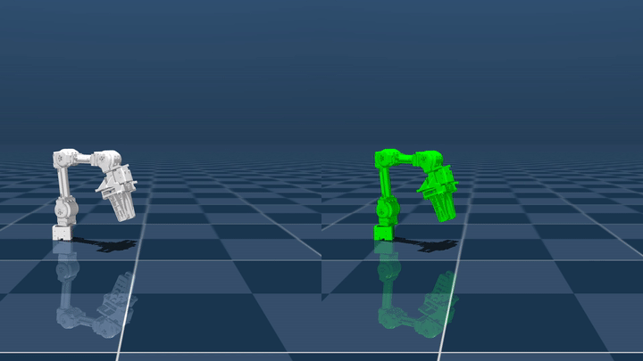
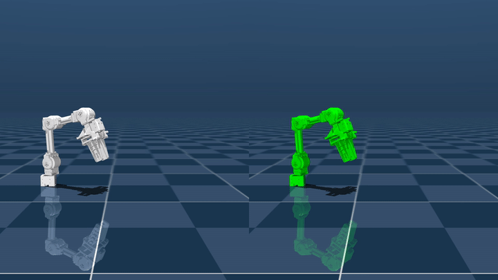
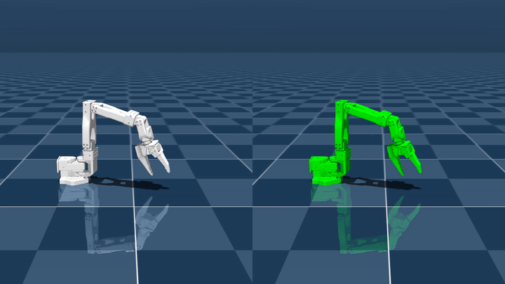
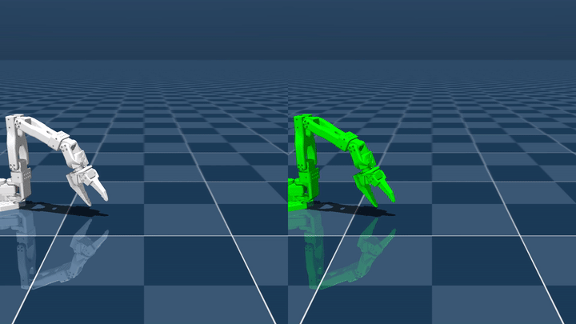
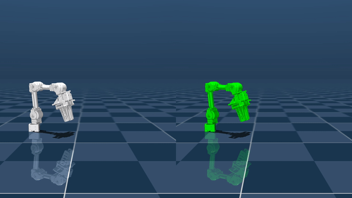
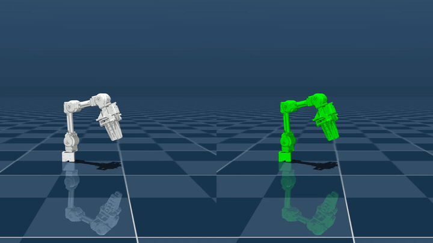
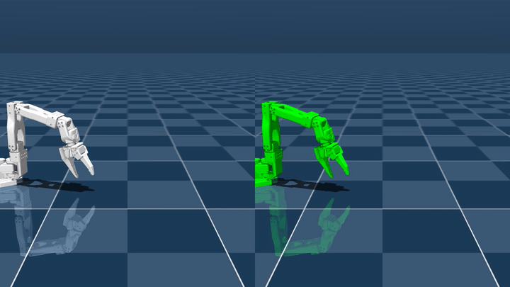
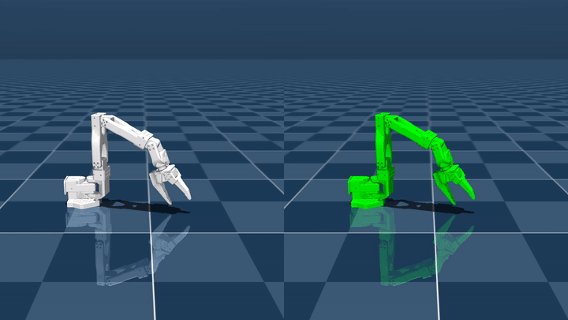
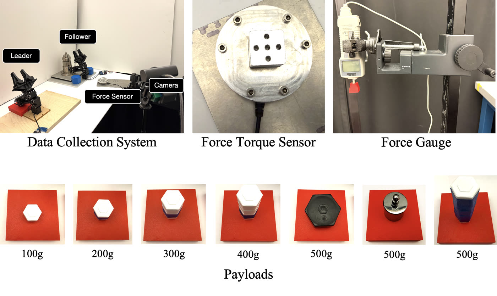
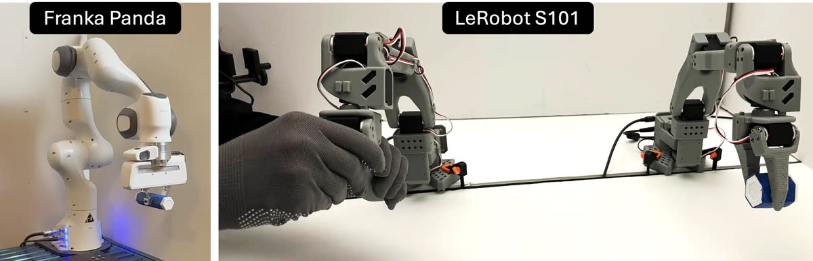

<div align="center">
<h1>NeuralActuator: Neural Actuation Modeling for Robot Dynamics and External Force Perception</h1>

<a href="https://frank-zy-dou.github.io/projects/NeuralActuator/index.html"></a>
<a href="LICENSE"></a>
<a href="docs/dataset.md"></a>
<!-- arXiv badge goes here once the paper is on arXiv -->

**Robotics: Science and Systems (RSS) 2026**


Zhiyang Dou<sup>1</sup>, John U. Onyemelukwe<sup>1*</sup>, Hangxing Zhang<sup>1*</sup>, Heng Zhang<sup>1</sup>, Minghao Guo<sup>1</sup>, Yunsheng Tian<sup>1</sup>,<br>
Michal Piotr Lipiec<sup>1</sup>, Joshua Jacob<sup>1</sup>, Chao Liu<sup>1</sup>, Peter Yichen Chen<sup>1</sup>, Yuri Ivanov<sup>2&dagger;</sup> and Wojciech Matusik<sup>1</sup>

<sup>1</sup>MIT&emsp;<sup>2</sup>Amazon Robotics

<sub><sup>*</sup>Research Assistant at MIT CDFG, equal contribution.&emsp;<sup>&dagger;</sup>The work of this author does not relate to their position at Amazon.</sub>
</div>

## Updates

- **[July 2026]** Initial release: training and evaluation code for the OpenManipulator-X
  and SO-101; the Neural Actuation Dataset (NAD) with 450 trajectories across 45 tasks
  on the two platforms; ten pretrained checkpoints; both inference modes (dynamics
  rollout and the virtual force sensor); the twin-arm teleoperation and data-collection
  code (`teleop/`, `hardware/`); and the hardware guide with sourcing links.

## Overview

A neural actuator model for low-cost servo-driven robot platforms, linking actuator
telemetry to differentiable dynamics, sensorless force perception, and force-aware
sim-to-real control.

### 1. Torque-Label-Free Differentiable Actuator Learning

Learns joint torque from real pose trajectories by backpropagating through
differentiable simulation, avoiding torque labels and reliable current-to-torque
calibration on low-cost platforms.

$$
\min_{\theta}\left\|\mathrm{DiffSim}\left(f_{\theta}(\cdot)\right)-q^{\mathrm{real}}\right\|
$$

### 2. History-Dependent Nonlinear Actuator Modeling

Uses a Transformer over commands, proprioception, and actuator telemetry to model
nonlinear and time-varying torque behavior associated with friction, backlash,
saturation, hysteresis, and thermal drift.

### 3. Unified Actuation and Proprioceptive Force Perception

Jointly predicts actuator torque $\tau$, the 3-axis end-effector external force
$f_{\mathrm{ext}} \in \mathbb{R}^3$, contact gate $g$, and motor condition $c$,
supporting sensorless force perception, motor-health monitoring, and force-aware
downstream control.

$$
M(q)\ddot{q}+C(q,\dot{q})\dot{q}+g(q)=\tau+\tau_{\mathrm{ext}},
\qquad
\tau_{\mathrm{ext}}=J(q)^{\top}f_{\mathrm{ext}}.
$$

Here, $\tau$ is the actuator-side joint torque, $f_{\mathrm{ext}}$ is the predicted
end-effector external force, and $\tau_{\mathrm{ext}}$ is its joint-space image through
the manipulator Jacobian.

This repository ships the training and evaluation code. The model is a Transformer that
maps commanded positions, motor currents and actuator telemetry to the outputs
above; the torque head is trained through a differentiable simulator (MuJoCo MJX), and
the force and motor-condition heads use direct supervision from the force sensor and
the condition flags.

## Contributing actuation data

Nothing in the model is specific to the two arms above: any arm that logs commanded
positions and basic motor telemetry can be modeled, from hobby servos to industrial
gearboxes, and every actuator family the model sees makes it better. To contribute,
record trajectories in the CSV format described in [docs/dataset.md](docs/dataset.md)
and open an issue or pull request. We will help wire new robots into the configs and
credit contributed datasets in this README.

Actuation datasets currently available:

| Robot arm | Actuators | Data |
|---|---|---|
| ROBOTIS OpenManipulator-X | Dynamixel XM430-W350 | `data/` (NAD, 35 tasks) |
| SO-101 (LeRobot) | Feetech STS3215 | `data/so101/` (10 task-payload combinations) |

## Future work

- **Synthetic-to-Real Actuator Pretraining** — Leverage large-scale synthetic actuator
  data for pretraining, followed by real-world fine-tuning to reduce costly hardware
  data collection.
- **Cross-Morphology Actuation Learning** — Extend NeuralActuator toward different
  robot morphologies and actuator families for more generalizable actuation modeling.
- **Scalable Whole-Body Force Perception** — Move beyond single-arm end-effector force
  estimation toward multi-joint and whole-body force-aware robot control.

## Setup

```bash
conda create -n neural_actuator python=3.10 -y
conda activate neural_actuator
pip install -r requirements.txt
python -c "import jax; print(jax.devices())"   # should list a GPU
```

Headless servers need EGL for MJX and rendering:

```bash
export MUJOCO_GL=egl PYOPENGL_PLATFORM=egl
```

## Data and pretrained checkpoints

The Neural Actuation Dataset ships with this repository under `data/` (no separate
download). The pretrained checkpoints are a separate download from the repository's
Releases page, see [Released weights](#released-weights). Data layout:

```
data/
  force_unlabeled/<task>/{train,validation,test}/*.csv     # free motion (10 tasks)
  force_sensor/<direction>/{train,validation,test}/*.csv   # +-X/Y/Z pushes and matched no-contact refs (12)
  weight/<task>/{train,validation,test}/*.csv              # 200-500 g payloads + 2 no-load refs (9)
  motor_condition/<task>/{train,validation,test}/*.csv     # normal vs degraded joint 3 (4)
```

Each task has 8 training, 1 validation and 1 test trajectory; force `-999` marks frames
without force-sensor readings. Full directory layout, per-column CSV schema and unit
conventions for both platforms are in [docs/dataset.md](docs/dataset.md).

To evaluate the provided checkpoints without training, pass them to the eval scripts
directly, e.g. `bash scripts/eval_force_sensor.sh checkpoints/omx_force_sensor.pkl 0`.

## Released weights

The pretrained checkpoints ship separately from the code and dataset, as assets on
this repository's Releases page. Verify the download against these md5 sums:

| File | Benchmark | md5 |
|---|---|---|
| `omx_no_load_with_gripper.pkl` | Table 1, with-gripper tasks | `8233a0ba1b9629b2b7dd5b2a81a2e536` |
| `omx_no_load_no_gripper.pkl` | Table 1, no-gripper tasks | `548929e3b54680a467b27aef48983d70` |
| `omx_force_sensor.pkl` | Table 2, force sensor | `486b4a7681d379825643d3f2eab3d659` |
| `omx_weight_all_ema.pkl` | Table 3, all nine weight tasks (EMA weights, reported above) | `c463eaabf653884158f51201097ea00c` |
| `omx_weight_all.pkl` | Table 3, all nine weight tasks (raw weights of the same run) | `60ecebb84c3e8d1b94d651e96ff355fc` |
| `omx_pick_place.pkl` | Table 3, pick-and-place subset | `8d9834930126459c906c3cf756e39859` |
| `omx_motor_condition.pkl` | Table 4, motor condition | `e15721cc63fe56bbfaf89d2eb1b0314d` |
| `so101_weight.pkl` | SO-101 weight benchmark, paper protocol (six 300-500 g tasks) | `95e9ed8b076f4011bfd3d6dc32876363` |
| `so101_weight_extended.pkl` | SO-101 weight benchmark, extended ten-task data | `6ab6f6ea031d04a5c50b76eabd1c2020` |
| `so101_weight_residual.pkl` | SO-101 weight benchmark, residual parameterization | `37027625f46837fc89fc66a2acb47574` |

The Table 3 checkpoint ships as both the raw and the EMA weights of the same training
run; the results table reports the EMA variant.

## Training

One config per benchmark, one GPU per run:

```bash
bash scripts/train_no_load_no_gripper.sh 0    # Table 1, rows 1-8
bash scripts/train_no_load_with_gripper.sh 1  # Table 1, rows 9-10
bash scripts/train_force_sensor.sh 2          # Table 2
bash scripts/train_weight_all.sh 3            # Table 3, all nine weight tasks
bash scripts/train_lift_hold.sh 4             # Table 3, go-up-and-stay subset
bash scripts/train_pick_place.sh 5            # Table 3, pick-and-place subset
bash scripts/train_motor_condition.sh 6       # Table 4
```

Checkpoints are written to `outputs/` (`*_best_train.pkl`, `*_best_val.pkl`,
`*_best_test.pkl`, `*_last.pkl`).
Each checkpoint stores the network parameters together with the feature-normalization
statistics and an EMA copy of the weights, so evaluation needs no extra files. Training
logs go to TensorBoard under the run's log directory.

Runs converge well before the epoch limit; the early-stopping targets in the configs
stop them automatically. On a single A100 the force-sensor model reaches its target in
a few hours.

### Training recipes

The force-sensor, motor-condition, with-gripper and subset checkpoints are single
from-scratch runs of the configs above. The no-gripper and weight checkpoints fine-tune
the scratch `weight_all` run: `bash scripts/train_weight_all.sh` first, then
`scripts/train_no_load_no_gripper_ft.sh` for Table 1 or `scripts/train_weight_all_ft1.sh`
followed by `scripts/train_weight_all_ft2.sh` for Table 3. The SO-101 extended checkpoint
chains `scripts/train_so101_extended.sh` and `scripts/train_so101_extended_ft.sh` the same
way; each `*_ft` config names its starting checkpoint under `resume_from`.

## Evaluation

```bash
bash scripts/eval_force_sensor.sh outputs/force_sensor_params_best_val.pkl 0
```

This reproduces the windowed MAE protocol from the paper (joint MAE in degrees, gripper
MAE in mm, force MAE in N at 10-600-step horizons), writes a JSON with all
metrics plus a LaTeX table, and dumps per-task rollouts for rendering:

```bash
python render_rollout.py --rollout_dir outputs/force_sensor_rollouts --output_dir outputs/videos
```

Each video shows the model rollout on the left (white arm, predicted contact force as
a red arrow at the gripper) and the recorded ground truth on the right (green arm,
measured force). The same tool renders SO-101 rollout dumps; encoding needs `ffmpeg`
on the PATH.

For Table 4, evaluate the motor-condition model and pass its JSON to the baselines
script to get the full comparison table:

```bash
bash scripts/eval_motor_condition.sh outputs/motor_condition_params_best_val.pkl 0
python eval_motor_condition_baselines.py --ours_json outputs/motor_condition_eval.json
```

The released numbers use each run's `*_best_test.pkl` checkpoint, except motor
condition, which uses `*_best_train.pkl`.

## Inference

The released checkpoint runs in two inference modes: rolling out the learned
dynamics in the differentiable simulator, or estimating external force from motor
telemetry alone with no simulator in the loop. Every clip below is a side-by-side
pair: the left panel is the model side in white, the right panel is the recorded
ground-truth trajectory in green. Red arrows show forces at the gripper: the arrow
in the left panel is the model's predicted weight force, the arrow in the right
panel is the gravitational ground truth — 4.9 N at the 500 g payload. The predicted
force arrow scales with the true load (2.94 N at 300 g vs. 4.9 N at 500 g), tracking
the ground-truth arrow in the right panel. Each mode below shows the
OpenManipulator-X and the SO-101, each at 500 g and 300 g, all on the
pick-and-place task.

### Dynamics rollout

The with-simulator mode rolls the learned dynamics out on a recorded trajectory: the
left panel plays the simulated motion, the right panel the recording.

<table align="center">
  <tr>
    <th align="center">OpenManipulator-X, 500 g</th>
    <th align="center">OpenManipulator-X, 300 g</th>
  </tr>
  <tr>
    <td align="center"></td>
    <td align="center"></td>
  </tr>
  <tr>
    <td align="center"><code>python infer_actuator.py --robot omx ...</code></td>
    <td align="center"><code>python infer_actuator.py --robot omx ...</code></td>
  </tr>
  <tr>
    <th align="center">SO-101, 500 g</th>
    <th align="center">SO-101, 300 g</th>
  </tr>
  <tr>
    <td align="center"></td>
    <td align="center"></td>
  </tr>
  <tr>
    <td align="center"><code>python infer_actuator.py --robot so101 ...</code></td>
    <td align="center"><code>python infer_actuator.py --robot so101 ...</code></td>
  </tr>
</table>

Besides the batch eval scripts, `infer_actuator.py` rolls a checkpoint out on a single
trajectory CSV and writes the per-step predictions (simulated joint positions, torque,
force, gate) to npz or csv, printing per-joint MAE:

```bash
python infer_actuator.py --robot omx --checkpoint checkpoints/omx_weight_all_ema.pkl \
    --config configs/lift_hold.yaml \
    --csv data/weight/pick_place_object_500g/test/001.csv \
    --out outputs/pick_place_500g_pred.npz

python infer_actuator.py --robot so101 --checkpoint checkpoints/so101_weight_extended.pkl \
    --config configs/so101_weight.yaml \
    --csv data/so101/pick_and_place/500g/test/001.csv \
    --out outputs/so101_pick_place_500g_pred.npz
```

The config only supplies the architecture and simulation settings, which all released
checkpoints share, so any config for the same robot works. `--use_ema` evaluates the EMA
weights stored in the checkpoint instead of the raw parameters.

### Virtual force sensor

The deployment use case is external-force estimation from motor telemetry alone: at
runtime the network needs nothing but the streaming servo readings, and the simulator
is only used for training and for the pose-rollout evaluation above. This is the same
released checkpoint in both cases — training always runs through the differentiable
simulator; the two modes only differ in how the model is queried at inference time.
In the clips below the two panels move identically, since deployment does not
simulate motion.

<table align="center">
  <tr>
    <th align="center">OpenManipulator-X, 500 g</th>
    <th align="center">OpenManipulator-X, 300 g</th>
  </tr>
  <tr>
    <td align="center"></td>
    <td align="center"></td>
  </tr>
  <tr>
    <td align="center"><code>python infer_actuator.py --robot omx ... --force_only</code></td>
    <td align="center"><code>python infer_actuator.py --robot omx ... --force_only</code></td>
  </tr>
  <tr>
    <th align="center">SO-101, 500 g</th>
    <th align="center">SO-101, 300 g</th>
  </tr>
  <tr>
    <td align="center"></td>
    <td align="center"></td>
  </tr>
  <tr>
    <td align="center"><code>python infer_actuator.py --robot so101 ... --force_only</code></td>
    <td align="center"><code>python infer_actuator.py --robot so101 ... --force_only</code></td>
  </tr>
</table>

`--force_only` runs the deployment path on a recorded stream — the feature history is
built from the CSV rows exactly as it would be from a live robot, and the script writes
per-step force, gate and torque (no `sim_q`):

```bash
python infer_actuator.py --robot omx --checkpoint checkpoints/omx_weight_all_ema.pkl \
    --config configs/lift_hold.yaml \
    --csv data/weight/pick_place_object_500g/test/001.csv \
    --force_only --out outputs/pick_place_500g_force.npz
```

A forward pass takes about 2 ms per step on a plain CPU after JIT warmup (2.6 ms OMX,
1.6 ms SO-101), well inside the ~60 Hz telemetry rate, so no GPU is
needed at runtime.

## Results

All numbers are evaluations of the released checkpoints on the NAD test split (joint
MAE in degrees, gripper MAE in mm, force MAE in N; "full" = the whole test
trajectory). Regenerate with the eval scripts. Note: the released checkpoints perform
better than the numbers reported in the paper.

<details>
<summary>Table 1: no-load simulation accuracy</summary>

| | J1 | J2 | J3 | J4 | Grip (mm) |
|---|---|---|---|---|---|
| With-gripper tasks, full | 0.26 | 0.40 | 0.48 | 0.61 | 0.28 |
| No-gripper tasks, full | 0.13 | 0.39 | 0.31 | 0.39 | - |

Both released checkpoints use the default direct-torque parameterization. The residual
variant documented in the paper appendix reaches 0.49 deg average (0.64 deg worst joint)
on the no-gripper tasks under the same protocol; the direct checkpoint (0.30 deg
average, 0.39 deg worst joint) now wins on both counts, so the earlier reason to prefer
the residual variant on these tasks is gone. The no-gripper checkpoint is warm-started
from the weight-benchmark checkpoint and fine-tuned with a 15k-epoch cosine anneal.
</details>

<details>
<summary>Table 2: external force sensing</summary>

| | J1 | J2 | J3 | J4 | Grip (mm) | F contact (N) | F no-contact (N) |
|---|---|---|---|---|---|---|---|
| Full trajectory | 0.82 | 1.00 | 1.03 | 0.95 | 0.09 | 0.44-0.57 (mean 0.49) | ~0.00 |

Joint and gripper columns are 12-task averages; force columns are per-task ranges over
the six contact / six no-contact trajectories.
</details>

<details>
<summary>Table 3: payload (weight) benchmark</summary>

The checkpoint ships in two forms,
the raw weights (`omx_weight_all.pkl`) and an EMA copy from the same run (`omx_weight_all_ema.pkl`);
the row below is the EMA variant, the raw weights land within 0.02 deg per joint column.

| | J1 | J2 | J3 | J4 | Grip (mm) | F (N) |
|---|---|---|---|---|---|---|
| `weight_all` (EMA), 9-task average, full | 0.41 | 0.49 | 0.59 | 0.63 | 0.12 | 0.005-0.231 per loaded task (3-axis; the two no-load reference tasks read 0.000) |

The per-task force-z MAE (the
loaded axis) is 0.014-0.692 N (mean 0.310). The pick-and-place-only checkpoint lands
at 0.78-2.00 deg per joint and 0.000-0.225 N per task on its 5-task subset.

The row averages all nine weight tasks, including the two no-load reference tasks.
</details>

<details>
<summary>Table 4: motor condition detection</summary>

Baselines are the threshold, SVM and random-forest detectors from
`eval_motor_condition_baselines.py`.

| Metric | Threshold | SVM | RF | Released |
|---|---|---|---|---|
| Accuracy | 58.6% | 59.9% | 67.1% | 100.0% |
| Precision | 0.0% | 52.6% | 62.3% | 100.0% |
| Recall | 0.0% | 31.7% | 52.4% | 100.0% |
| AUC-ROC | 0.45 | 0.62 | 0.72 | 1.000 |
</details>

## SO-101 (LeRobot arm)

The pipeline also runs on a second platform, the 6-DoF SO-101 arm (Feetech STS3215
servos, LeRobot ecosystem). Its data ships in the same bundle under `data/so101/`:

```
data/
  so101/<task>/<payload>/{train,validation,test}/*.csv
```

with `<task>` one of `go_up_and_stay_still`, `pick_and_place` and `<payload>` one of
`empty`, `200g`, `300g`, `400g`, `500g`. Each of the 10 combinations has 8 training,
1 validation and 1 test trajectory (~62 Hz); the on-disk split is used as-is.

```bash
bash scripts/train_so101_weight.sh 0          # paper protocol, six 300-500 g tasks
bash scripts/eval_so101_weight.sh outputs/so101_weight_params_best_val.pkl 0

bash scripts/train_so101_extended.sh 0        # extended ten-task data
bash scripts/train_so101_extended_ft.sh 0     # fine-tune of the extended run
bash scripts/eval_so101_extended.sh outputs/so101_extended_ft_params_best_val.pkl 0
```

The shipped `configs/so101_weight.yaml` follows the paper's protocol scope (the six
300-500 g combinations, the `so101_weight.pkl` recipe); `configs/so101_extended.yaml` and
`configs/so101_extended_ft.yaml` are the two stages behind the extended checkpoint
`so101_weight_extended.pkl`, trained on all ten combinations.

Architecture and feature normalization are identical to the OMX model; the
Transformer's `n_joints` parameter is 6 instead of 5, and the input is the 42-D
SO-101 feature layout (goal position, position, signed load, velocity, voltage,
temperature and position error for six joints — the jaw is joint 6, so there are no
separate gripper channels). The robot model is `robot_so101/so101_torque_scene.xml`,
the onshape-to-robot SO-101 export with torque actuators. The SO-101 rig has no
end-effector force sensor: force labels are derived from the known payload weight
(force_z only), frames without a valid label carry the `-999` sentinel, and the config
enables `mask_invalid_force` so those frames are excluded from the force loss.

<details>
<summary>SO-101 weight benchmark</summary>

Three checkpoints ship. `so101_weight` matches the paper's main-text scope: trained from
scratch on the six 300-500 g task-weight combinations. `so101_weight_extended` trains on the
extended ten-combination data (adding the empty and 200 g payloads). `so101_weight_residual` repeats
the protocol scope with the residual torque parameterization (Feetech datasheet
torque-constant anchor); as on the OMX, the direct parameterization wins.

| | Joint MAE (deg) | Force MAE (N) |
|---|---|---|
| `so101_weight` (paper protocol, 6 tasks), full trajectory | 1.52 worst per-joint MAE averaged over the 6 tasks (worst single task-joint cell 2.50) | 0.22 all-task mean (per-task 0.14-0.30) |
| `so101_weight_extended` (extended data, 10 tasks), full trajectory | 1.10 worst per-joint MAE averaged over the 10 tasks (worst single task-joint cell 1.98) | 0.26 all-task mean (loaded tasks 0.33; the two empty-payload tasks read ~0.00) |
| `so101_weight_residual` (residual variant, 6 tasks), full trajectory | 1.53 worst per-joint MAE averaged over the 6 tasks (worst single task-joint cell 2.97) | 0.38 all-task mean |
</details>

## Residual torque variant

The released default predicts joint torque directly from the observation history
$\mathbf{o}_{t-H:t}$:

$$\boldsymbol{\tau}_t = \boldsymbol{\tau}_{\text{net}}(\mathbf{o}_{t-H:t})$$

The trainer also supports a residual parameterization (`use_residual_torque: true`,
`torque_constant`), where the network predicts a correction on top of the linear
current-torque baseline:

$$\boldsymbol{\tau}_t = K_t \mathbf{i}_t + \boldsymbol{\tau}_{\text{net}}(\mathbf{o}_{t-H:t}),\qquad K_t = 1.3\ \text{N·m/A (XM430 datasheet)}$$

We release the direct parameterization as the default. The linear baseline is exactly
the inductive bias the paper argues breaks down on low-cost servos; predicting torque
directly removes that prior and the dependence on a hand-calibrated $K_t$. In our
experiments the residual variant stabilizes the first few hundred epochs (the baseline
supplies gravity compensation from the start) and converges to comparable tracking
accuracy. Released results for both parameterizations:

| | Direct (default) | Residual |
|---|---|---|
| OMX no-gripper tasks, full (average / worst per-joint MAE, deg) | 0.30 / 0.39 | 0.49 / 0.64 |
| SO-101 paper protocol, 6 tasks, full (worst per-joint MAE, deg / force MAE all-task mean, N) | 1.52 / 0.22 | 1.53 / 0.38 |

## Hardware

All numbers in this repository come from data collected on the OMX and SO-101 setups
below. The 6-axis
force/torque sensor used for force ground truth and the joint-torque sensor used for
torque validation are internal lab equipment and are not publicly available; everything
else is off the shelf.

<p align="center">
  
</p>

| Component | Source |
|---|---|
| 2x ROBOTIS OpenManipulator-X (RM-X52-TNM), leader + follower | [robotis.com](https://en.robotis.com/shop_en/item.php?it_id=905-0024-000) |
| SO-101 arm (LeRobot, Feetech STS3215), leader + follower | [TheRobotStudio/SO-ARM100](https://github.com/TheRobotStudio/SO-ARM100) (BOM, sourcing, kits) |
| Digital force gauge, BAOSHISHAN ZP-500N (RS232 output) | [amazon.com](https://www.amazon.com/BAOSHISHAN-Interface-Measuring-Instruments-Destructive/dp/B07VSDF1CX) |
| Payload set, standard calibration weights, 100-500 g | [amazon.com](https://www.amazon.com/dp/B000URHLLO) |
| 6-axis F/T sensor, joint-torque sensor | internal equipment, not publicly available |

<p align="center">
  
</p>
<p align="center"><i>The paper's cross-platform arms. The Franka Panda experiments are not part of this release.</i></p>

The arms are driven over U2D2 USB adapters (leader on `/dev/ttyUSB0`, follower on
`/dev/ttyUSB1`); wiring, motor IDs, PID settings and the CSV recording format are in
[teleop/README.md](teleop/README.md). `hardware/` holds the stand-alone sensor readers
used during collection: `hardware/force_sensoring/` streams the 6-axis F/T sensor and
`hardware/force_gauge_reader.py` reads the ZP-500N over serial.

## License

This repository is released under the MIT License; see [LICENSE](LICENSE). The robot
models under `robot/` and `robot_so101/` are third-party assets with their own
Apache-2.0 licenses, listed under [Acknowledgements](#acknowledgements).

## Acknowledgements

- `robot/`: OpenManipulator-X model from [ROBOTIS' mujoco menagerie](https://github.com/ROBOTIS-GIT/robotis_mujoco_menagerie)
  (Apache-2.0, see `robot/LICENSE`), with the position actuators replaced by torque
  actuators and joint ranges widened to cover the recorded trajectories.
- `robot_so101/`: SO-101 model from [TheRobotStudio's SO-ARM100](https://github.com/TheRobotStudio/SO-ARM100)
  (Apache-2.0, see `robot_so101/LICENSE`), with the same torque-actuator conversion;
  see `robot_so101/README.md`.

## Citation

```bibtex
@inproceedings{dou2026neuralactuator,
  title     = {{NeuralActuator}: Neural Actuation Modeling for Robot Dynamics and External Force Perception},
  author    = {Dou, Zhiyang and Onyemelukwe, John U. and Zhang, Hangxing and Zhang, Heng and Guo, Minghao and Tian, Yunsheng and Lipiec, Michal Piotr and Jacob, Joshua and Liu, Chao and Chen, Peter Yichen and Ivanov, Yuri and Matusik, Wojciech},
  booktitle = {Proceedings of Robotics: Science and Systems (RSS)},
  year      = {2026}
}
```
