<div align="center">
<h1>S4R: Scaling for Rigid-Body Interpenetration Resolution</h1>

<!-- <a href="PROJECT_PAGE_URL"></a> -->
<!-- <a href="ARXIV_URL"></a> -->
<a href="LICENSE"></a>
<a href="data/"></a>

**SIGGRAPH Asia 2026 (Journal Track)**

Zhiyang Dou<sup>1*</sup>, Ang Zhao<sup>2*</sup>, Chen Peng<sup>3</sup>, Minghao Guo<sup>1</sup>, Haixu Wu<sup>1</sup>, Cheng Lin<sup>4</sup>,<br>
Yuan Liu<sup>5</sup>, Junfeng Yao<sup>2</sup>, Xiaohu Guo<sup>6</sup>, Wenping Wang<sup>7</sup> and Wojciech Matusik<sup>1&dagger;</sup>

<sup>1</sup>MIT CSAIL&emsp;<sup>2</sup>Xiamen University&emsp;<sup>3</sup>The University of Hong Kong&emsp;<sup>4</sup>Macau University of Science and Technology<br>
<sup>5</sup>The Hong Kong University of Science and Technology&emsp;<sup>6</sup>The University of Texas at Dallas&emsp;<sup>7</sup>Texas A&amp;M University

<sub><sup>*</sup>Equal contribution.&emsp;<sup>&dagger;</sup>Corresponding author.</sub>
</div>

## Overview

Penetration-free configurations are a prerequisite for physical
simulation and any downstream contact-dependent task; generated or
roughly placed 3D scenes routinely contain mesh-level overlaps that
break those pipelines.

S4R resolves rigid-body interpenetration by progressive scaling: every
body is first shrunk about its own reference center to a small initial
scale, then restored to full size along a monotone scale schedule. Each
scale increment solves one small minimum-norm convex contact QP that
keeps the linearized separation margin; a conservative scale-event bound
and frozen-witness distance caching keep the number of exact mesh
queries low, and a bounded tail-refinement pass corrects the residual
contacts at full scale. Every returned pose is scored by a shared
mesh-level evaluator.

The clips below show the process from interpenetrating layouts to a
penetration-free state. Each clip pauses 2 s on the initial overlap, then
plays the optimization.

<table>
<tr>
<td>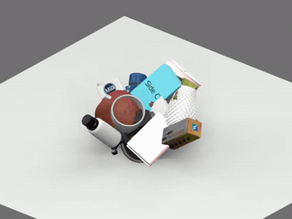</td>
<td>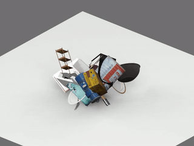</td>
<td>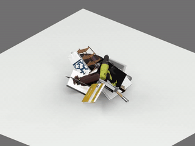</td>
<td>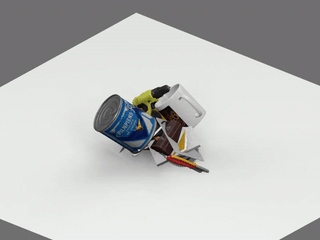</td>
</tr>
<tr>
<td>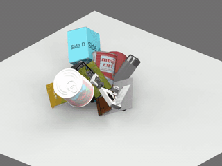</td>
<td>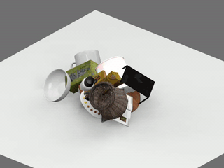</td>
<td>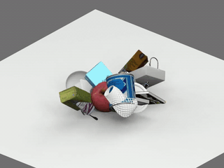</td>
<td>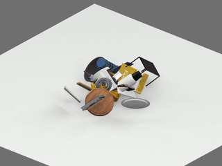</td>
</tr>
<tr>
<td>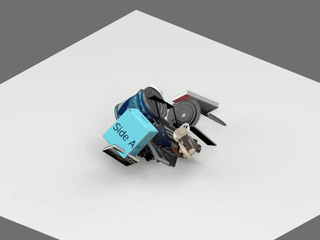</td>
<td>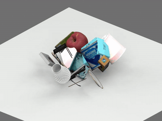</td>
<td>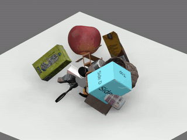</td>
<td>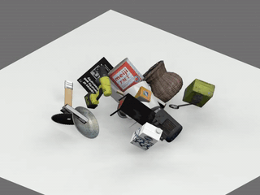</td>
</tr>
<tr>
<td>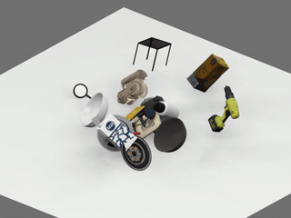</td>
<td>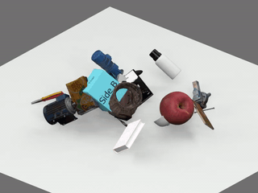</td>
<td>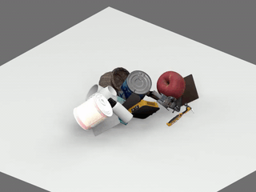</td>
<td>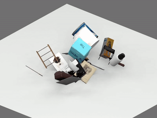</td>
</tr>
</table>

## Layout

```
Penetration_Solving/
├── s4r/            CPU solver (progressive scaling + contact QP + FCL oracle)
│   ├── s4r_qp.py            solver: schedule, QP, SOI events, cache, tail
│   ├── mesh_collision.py    scene objects + shared mesh-level evaluator
│   ├── box_collision.py     rotation / OBB utilities
│   └── common.py            shared dataclasses
├── s4r_gpu/        GPU-native solver (NVIDIA Warp)
│   ├── s4r_gpu_native.py    full-GPU pipeline (detection + dual APGD QP)
│   ├── dual_apgd.py         dual accelerated projected-gradient QP solver
│   ├── warp_pair_contact_v3.py  Warp mesh contact oracle
│   └── oracle_v4.py         batched all-GPU oracle
├── scenes/         benchmark scene generation (fixed seeds)
│   ├── make_scene.py        entry point: kubric / hy3d / thingi
│   ├── generate_hy3d_scene.py
│   └── generate_thingi10k_scene.py
├── data/
│   ├── kubric_pool/         40 watertight household meshes (19 MB)
│   └── hy3d_processed/      300 generated volume meshes, decimated to ≤1500 faces (175 MB)
├── examples/run_kubric.py   end-to-end demo
└── requirements.txt
```

## Getting started

Install the core (CPU) dependencies and run the demo:

```bash
pip install -r requirements.txt
python examples/run_kubric.py --N 40 --seed 42
```

`requirements.txt` installs only the core CPU stack. The optional extras
(`warp-lang` for the GPU solver, `thingi10k` for `--dataset thingi`) are
**not** pulled in by the line above; install them separately as shown
below.

Expected output on the bundled Kubric pool:

```
[init]  N=40 seed=42  penetrating pairs = 30
[final] penetrating pairs = 0   RMSD = 0.0379   solve = <1s
```

Scenes are deterministic in `(dataset, N, seed)`. The benchmark seeds in
the paper are 42, 123 and 456; `--dataset hy3d` uses the bundled
generated-mesh pool, and `--dataset thingi` streams meshes through the
`thingi10k` package on first use.

The GPU solver requires an NVIDIA GPU and `warp-lang`
(`pip install "warp-lang>=1.5"`):

```python
from s4r_gpu.s4r_gpu_native import solve_s4r_gpu
```

## Data

- `data/kubric_pool/` — the 40-mesh household-object pool used by the
  Kubric benchmarks. Meshes originate from Google Scanned Objects
  (CC-BY 4.0); attribution to the original dataset applies.
- `data/hy3d_processed/` — 300 watertight volume meshes generated with
  [Tencent Hunyuan3D](https://github.com/Tencent-Hunyuan/Hunyuan3D-2) and
  processed for collision use (decimated to ≤1500 faces, per-mesh visual
  and collision geometry). The generator is governed by the Tencent
  Hunyuan3D Community License; the generated meshes are distributed here
  for research use.
- Thingi10K scenes download on demand via the `thingi10k` package
  (`pip install thingi10k`); per-model licenses are preserved by upstream
  and nothing is redistributed here.

## Citation

```bibtex
@article{dou2026s4r,
  title   = {S4R: Scaling for Rigid-Body Interpenetration Resolution},
  author  = {Dou, Zhiyang and Zhao, Ang and Peng, Chen and Guo, Minghao and
             Wu, Haixu and Lin, Cheng and Liu, Yuan and Yao, Junfeng and
             Guo, Xiaohu and Wang, Wenping and Matusik, Wojciech},
  journal = {ACM Transactions on Graphics (SIGGRAPH Asia)},
  year    = {2026},
}
```

## License

Code is released under the [MIT License](LICENSE). Bundled meshes keep
their upstream licenses (see [Data](#data)).
