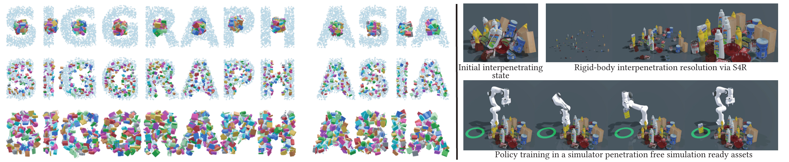
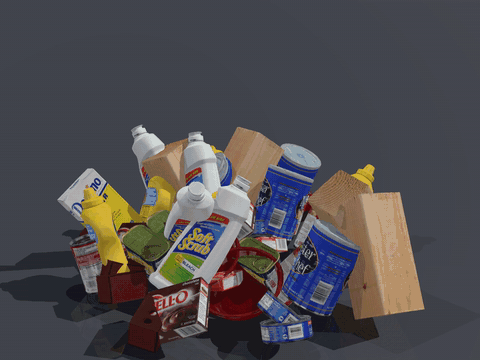
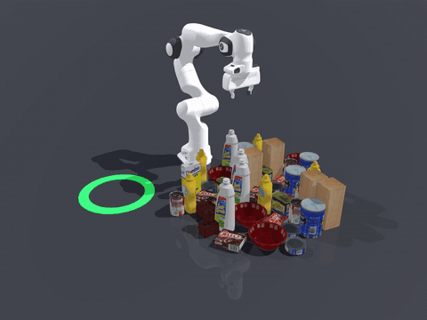

<div align="center">
<h1>S4R: Scaling for Rigid-Body Interpenetration Resolution</h1>

<!-- <a href="PROJECT_PAGE_URL"></a> -->
<!-- <a href="ARXIV_URL"></a> -->
<a href="LICENSE"></a>
<a href="data/"></a>

**SIGGRAPH Asia 2026 (Journal Track)**

Zhiyang Dou<sup>1*</sup>, Ang Zhao<sup>2*</sup>, Chen Peng<sup>3</sup>, Minghao Guo<sup>1</sup>, Haixu Wu<sup>1</sup>, Cheng Lin<sup>4</sup>,<br>
Yuan Liu<sup>5</sup>, Junfeng Yao<sup>2</sup>, Xiaohu Guo<sup>6</sup>, Wenping Wang<sup>7</sup> and Wojciech Matusik<sup>1&dagger;</sup>

<sup>1</sup>MIT CSAIL&emsp;<sup>2</sup>Xiamen University&emsp;<sup>3</sup>The University of Hong Kong&emsp;<sup>4</sup>Macau University of Science and Technology<br>
<sup>5</sup>The Hong Kong University of Science and Technology&emsp;<sup>6</sup>The University of Texas at Dallas&emsp;<sup>7</sup>Texas A&amp;M University

<sub><sup>*</sup>Equal contribution.&emsp;<sup>&dagger;</sup>Corresponding author.</sub>


<p align="left"><sub><b>S4R resolves severe rigid-body interpenetrations at scale and produces
simulation-ready scenes.</b> <b>Left:</b> progressive scaling of 1,000 Kubric assets arranged to
spell &ldquo;SIGGRAPH ASIA,&rdquo; from an interpenetrating initialization to a penetration-free
configuration. <b>Right:</b> S4R efficiently converts cluttered 3D assets into simulation-ready
scenes for downstream robot policy training.</sub></p>

<table>
<tr>
<td></td>
<td></td>
</tr>
<tr>
<td><sub><b>Repair and settle.</b> 48 YCB objects spawned in interpenetration, resolved by S4R and settled in simulation (<a href="assets/ycb48_repair_and_settle.mp4">mp4</a>).</sub></td>
<td><sub><b>Pick and place.</b> On the repaired scene, a Franka arm picks the sugar box and sets it down in the ring (<a href="assets/ycb48_pick_and_place.mp4">mp4</a>).</sub></td>
</tr>
</table>
</div>

## 📢 Updates

* [September 2026] **SimReady Gate** — an agentic, language-driven layer on top of S4R that turns generated RoboLab and RoboCasa scenes into certified simulation-ready ones: a request becomes a typed constraint program, S4R repairs under it in scale-space, a probed mesh-level evaluator and a MuJoCo settle decide, and a certificate with provenance is written. Measured on RoboLab's 68 shipped scenes, on layouts from RoboLab's own placement solver, and on RoboCasa's counter regions with RoboCasa's own placement test. A separate project in this repository: [`../SimReady_Gate/`](../SimReady_Gate/).
* [September 2026] Timing tables extended to N = 2000 and 3000 on both the CPU and the GPU solver, with the hardware noted.
* [August 2026] Initial release: the CPU solver (progressive scaling, contact QP, SOI events, frozen-witness cache, tail refinement), the GPU-native solver on NVIDIA Warp, the benchmark scene generators with fixed seeds, the bundled Kubric pool and the processed HY3D meshes, and end-to-end examples.

## Table of Contents

* [📢 Updates](#-updates)
* [Overview](#overview)
* [SimReady Gate](#simready-gate)
* [Layout](#layout)
* [Getting started](#getting-started)
   * [Setup](#setup) · [Outcome of a run](#outcome-of-a-run) · [CPU solver at more sizes](#cpu-solver-at-more-sizes) · [GPU solver](#gpu-solver) · [Upright-on-plane repair with rotation](#upright-on-plane-repair-with-rotation)
* [Data](#data)
* [Citation](#citation)
* [License](#license)

## Overview

Penetration-free configurations are a prerequisite for physical
simulation and any downstream contact-dependent task; generated or
roughly placed 3D scenes routinely contain mesh-level overlaps that
break those pipelines.

S4R resolves rigid-body interpenetration by progressive scaling: every
body is first shrunk about its own reference center to a small initial
scale, then restored to full size along a monotone scale schedule. Each
scale increment solves one small minimum-norm convex contact QP that
keeps the linearized separation margin; a conservative scale-event bound
and frozen-witness distance caching keep the number of exact mesh
queries low, and a bounded tail-refinement pass corrects the residual
contacts at full scale. Every returned pose is scored by a shared
mesh-level evaluator.

The clips below show the process from interpenetrating layouts to a
penetration-free state. Each clip pauses 2 s on the initial overlap, then
plays the optimization.

<table>
<tr>
<td></td>
<td></td>
<td></td>
<td></td>
</tr>
<tr>
<td></td>
<td></td>
<td></td>
<td></td>
</tr>
<tr>
<td></td>
<td></td>
<td></td>
<td></td>
</tr>
<tr>
<td></td>
<td></td>
<td></td>
<td></td>
</tr>
</table>

## SimReady Gate

[SimReady Gate](../SimReady_Gate/) is a separate project in this repository built on S4R: a
language model writes a typed constraint program for a generated scene, S4R repairs the scene
under it in scale-space, and a probed mesh-level evaluator plus a MuJoCo settle certify the
result. It reads RoboLab (USD) and RoboCasa (MJCF) scenes directly and comes with the measured
diagnostics on their assets. See [`../SimReady_Gate/README.md`](../SimReady_Gate/README.md).

## Layout

```
Penetration_Solving/
├── s4r/            CPU solver (progressive scaling + contact QP + FCL oracle)
│   ├── s4r_qp.py            solver: schedule, QP, SOI events, cache, tail
│   ├── mesh_collision.py    scene objects + shared mesh-level evaluator
│   ├── box_collision.py     rotation / OBB utilities
│   └── common.py            shared dataclasses
├── s4r_gpu/        GPU-native solver (NVIDIA Warp)
│   ├── s4r_gpu_native.py    full-GPU pipeline (detection + dual APGD QP)
│   ├── dual_apgd.py         dual accelerated projected-gradient QP solver
│   ├── warp_pair_contact_v3.py  Warp mesh contact oracle
│   └── oracle_v4.py         batched all-GPU oracle
├── scenes/         benchmark scene generation (fixed seeds)
│   ├── make_scene.py        entry point: kubric / hy3d / thingi
│   ├── generate_hy3d_scene.py
│   └── generate_thingi10k_scene.py
├── data/
│   ├── kubric_pool/         40 watertight household meshes (19 MB)
│   └── hy3d_processed/      300 generated volume meshes, decimated to ≤1500 faces (175 MB)
├── examples/            end-to-end demos (run_kubric.py, run_upright.py)
├── tests/               regression tests (python -m unittest discover tests)
└── requirements.txt
```

## Getting started

### Setup

Install the core (CPU) dependencies and run the demo:

```bash
pip install -r requirements.txt
python examples/run_kubric.py --N 40 --seed 42
```

`requirements.txt` installs only the core CPU stack. The optional extras
(`warp-lang` for the GPU solver, `thingi10k` for `--dataset thingi`) are
**not** pulled in by the line above; install them separately as shown
below.

Expected output on the bundled Kubric pool:

```
[init]  N=40 seed=42  penetrating pairs = 30
[final] penetrating pairs = 0   RMSD = 0.0400   solve = <1s   status = converged
```

Scenes are deterministic in `(dataset, N, seed)`. The benchmark seeds in
the paper are 42, 123 and 456; `--dataset hy3d` uses the bundled
generated-mesh pool, and `--dataset thingi` streams meshes through the
`thingi10k` package on first use.

### Outcome of a run

Both solvers return a dictionary with an explicit outcome.
`continuation_complete` says whether the scale reached 1;
`native_converged` whether the solver's own full-scale tail test found no
penetrating pair (`tail_stop_reason` gives its exit); `status` is
`converged` only when the continuation is complete, the poses are finite,
the shared mesh evaluator finds no penetrating pair on the full-size
bodies, and any container walls or joints are satisfied. Otherwise it
names the reason (`max_steps`, `qp_failure`, `numerical_failure`,
`container_infeasible`, `residual_penetration`, `wall_violation`,
`joint_violation`). Penetration statistics are always taken on the
full-size bodies at the returned poses, whatever scale the continuation
reached, so a run that stopped early is never reported as clean.

The GPU pipeline detects contacts with a sampled oracle (vertices, edge
samples and edge-ray crossings on a winding-number SDF). At full scale it
re-checks the result with the exact FCL oracle (triangle crossings and
containment) and, if that check still finds a penetrating pair, runs
correction iterations with the exact contacts before scoring
(`fcl_verified`).

The regression tests cover these contracts, the broad-phase bound, the
witness directions, nested bodies, the starting-scale separation and the
OSQP status handling:

```bash
python -m unittest discover tests      # GPU tests skip without a CUDA device
```

All timings below were measured on an Intel Xeon E5-2680 v4 CPU
(2.40 GHz) and an NVIDIA GeForce RTX 2080 Ti GPU.

### CPU solver at more sizes

```bash
python examples/run_kubric.py --N 100  --seed 42
python examples/run_kubric.py --N 500  --seed 42
python examples/run_kubric.py --N 1000 --seed 42
```

| N | init pen. | final pen. | RMSD | solve |
|---|---|---|---|---|
| 40 | 30 | 0 | 0.0400 | 0.35 s |
| 100 | 80 | 0 | 0.0366 | 0.98 s |
| 500 | 371 | 0 | 0.0359 | 6.0 s |
| 1000 | 760 | 0 | 0.0365 | 15.7 s |
| 2000 | 1587 | 0 | 0.0380 | 37.2 s |
| 3000 | 2423 | 0 | 0.0388 | 79.1 s |

Every run ends with `status = converged`. The RMSD values are a few
percent above those of the previous revision because the broad phase now
keeps every pair within the d_hat band available to the correction QP.
The tail stops at zero penetration: a pair may end with a positive gap
smaller than d_hat, and no clearance is guaranteed.

### GPU solver

Requires an NVIDIA GPU and `warp-lang`; the first call in a process pays
a one-time kernel-compilation and allocation cost, included in the times
below.

```bash
python examples/run_kubric.py --N 40   --seed 42 --solver gpu
python examples/run_kubric.py --N 1000 --seed 42 --solver gpu
```

| N | init pen. | final pen. | RMSD | total |
|---|---|---|---|---|
| 40 | 30 | 0 | 0.0372 | 6.7 s |
| 100 | 80 | 0 | 0.0356 | 7.1 s |
| 500 | 371 | 0 | 0.0346 | 10.7 s |
| 1000 | 760 | 0 | 0.0346 | 17.0 s |
| 2000 | 1587 | 0 | 0.0358 | 31.2 s |
| 3000 | 2423 | 0 | 0.0362 | 54.4 s |

Every run ends with `status = converged` and `fcl_verified = True`; the
totals include the exact FCL re-check at full scale.

The GPU pipeline is also callable directly:

```python
from s4r_gpu.s4r_gpu_native import solve_s4r_gpu
```

### Upright-on-plane repair with rotation

The tabletop variant keeps every object standing on a common support
plane: roll/pitch tilt is driven to zero along the scale path while each
step optimizes in-plane translation and yaw. Snapshots at 30/60/90%
inflation and the final state are written to a JSON file.

```bash
python examples/run_upright.py --output upright_seed42.json  --N 12 --seed 42  --min-init-pen 8
python examples/run_upright.py --output upright_seed123.json --N 12 --seed 123 --min-init-pen 8
```

Both runs end with `final pen=0` and all objects upright on the plane;
the JSON holds the poses of every stage (`init`, `s30`, `s60`, `s90`,
`final`) for rendering.

## Data

- `data/kubric_pool/` — the 40-mesh household-object pool used by the
  Kubric benchmarks. Meshes originate from Google Scanned Objects
  (CC-BY 4.0); attribution to the original dataset applies.
- `data/hy3d_processed/` — 300 watertight volume meshes generated with
  [Tencent Hunyuan3D](https://github.com/Tencent-Hunyuan/Hunyuan3D-2) and
  processed for collision use (decimated to ≤1500 faces, per-mesh visual
  and collision geometry). The generator is governed by the Tencent
  Hunyuan3D Community License; the generated meshes are distributed here
  for research use.
- Thingi10K scenes download on demand via the `thingi10k` package
  (`pip install thingi10k`); per-model licenses are preserved by upstream
  and nothing is redistributed here.

## Citation

```bibtex
@article{dou2026s4r,
  title   = {S4R: Scaling for Rigid-Body Interpenetration Resolution},
  author  = {Dou, Zhiyang and Zhao, Ang and Peng, Chen and Guo, Minghao and
             Wu, Haixu and Lin, Cheng and Liu, Yuan and Yao, Junfeng and
             Guo, Xiaohu and Wang, Wenping and Matusik, Wojciech},
  journal = {ACM Transactions on Graphics (SIGGRAPH Asia)},
  year    = {2026},
}
```

## License

Code is released under the [MIT License](LICENSE). Bundled meshes keep
their upstream licenses (see [Data](#data)).
