# RigidFormer: Learning Rigid Dynamics using Transformers

**Project page:** [https://people.csail.mit.edu/frankzydou/projects/RigidFormer/index.html](https://people.csail.mit.edu/frankzydou/projects/RigidFormer/index.html)

Zhiyang Dou1, Minghao Guo1, Haixu Wu1, Doug Roble2, Tuur Stuyck2, Wojciech Matusik1

1 Massachusetts Institute of Technology &nbsp;&nbsp;&nbsp; 2 Meta

---

## Abstract

Learning-based simulation of multi-object rigid-body dynamics remains difficult because contact is discontinuous and errors compound over long horizons. Most existing methods remain tied to mesh connectivity and vertex-level message passing, which limits their applicability to mesh-free inputs such as point clouds and leads to high computational cost. Efficiently modeling high-fidelity rigid-body dynamics from mesh-free representations therefore remains challenging.

We introduce **RigidFormer**, an object-centric Transformer-based model that learns mesh-free rigid-body dynamics with controllable integration step sizes. RigidFormer reasons at the *object level* and advances each object through compact anchors; *Anchor-Vertex Pooling* enriches these anchors with local vertex features, retaining contact-relevant geometry without dense vertex-level interaction. We propose *Anchor-based RoPE* to inject anchor geometry into attention while respecting the unordered nature of objects and anchors: object-token processing is permutation-equivariant, and the mean-pooled anchor descriptor is invariant to anchor reindexing while preserving shape extent. RigidFormer further enforces *rigidity* by projecting updates onto the rigid-body manifold using differentiable Kabsch alignment.

On standard benchmarks, RigidFormer outperforms or matches mesh-based baselines using point inputs, runs faster, generalizes to unseen point resolutions and across datasets, and scales to 200+ objects; we also show a preliminary extension to command-conditioned articulated bodies by treating body parts as interacting object-level components.

---

## TODO

- [ ] Release dataset processing scripts.
- [ ] Release inference code for the MOVi datasets.
- [ ] Release training code for the MOVi datasets.

---

## Qualitative Results

> Meshes are shown only for visualization; our model operates on point inputs. Click any preview to open the full-quality MP4.

### MOVi-Sphere

<table>
<tr>
<td width="25%"><a href="assets/MoviS_sample_1.mp4">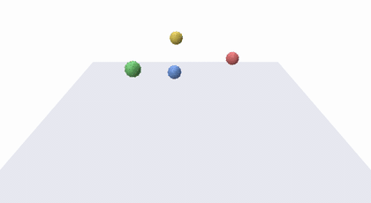</a></td>
<td width="25%"><a href="assets/MoviS_sample_2.mp4">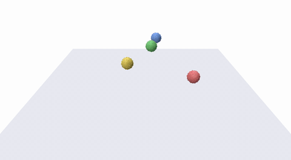</a></td>
<td width="25%"><a href="assets/MoviS_sample_3.mp4">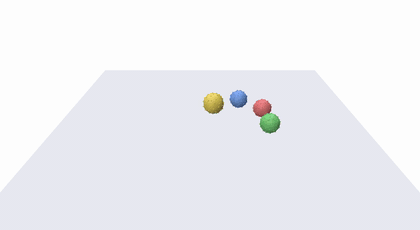</a></td>
<td width="25%"><a href="assets/MoviS_sample_4.mp4">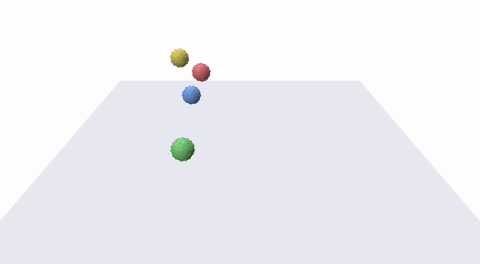</a></td>
</tr>
</table>

### MOVi-A

<table>
<tr>
<td width="25%"><a href="assets/MoviA_sample_1.mp4">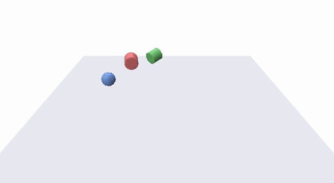</a></td>
<td width="25%"><a href="assets/MoviA_sample_2.mp4">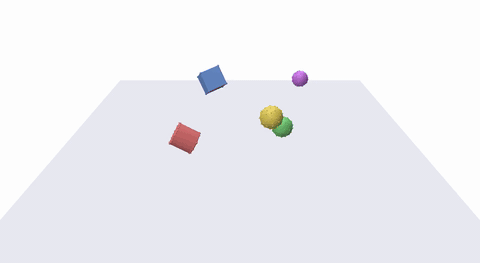</a></td>
<td width="25%"><a href="assets/MoviA_sample_3.mp4">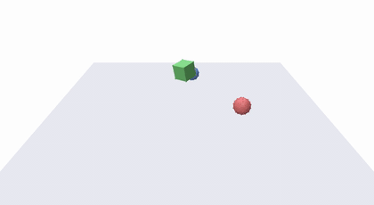</a></td>
<td width="25%"><a href="assets/MoviA_sample_4.mp4">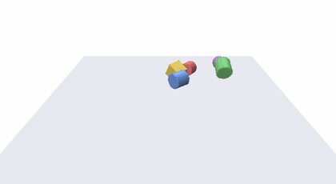</a></td>
</tr>
</table>

### MOVi-B

<table>
<tr>
<td width="25%"><a href="assets/MoviB_sample_1.mp4">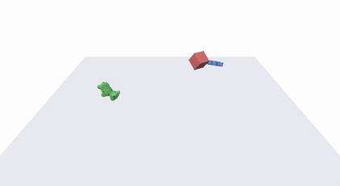</a></td>
<td width="25%"><a href="assets/MoviB_sample_2.mp4">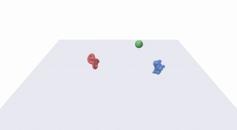</a></td>
<td width="25%"><a href="assets/MoviB_sample_3.mp4">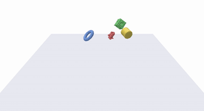</a></td>
<td width="25%"><a href="assets/MoviB_sample_4.mp4">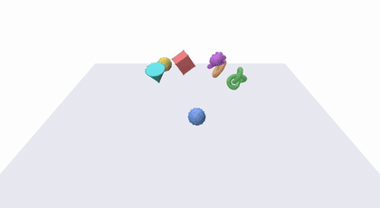</a></td>
</tr>
<tr>
<td width="25%"><a href="assets/MoviB_sample_5.mp4">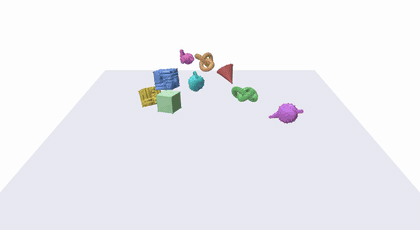</a></td>
<td width="25%"><a href="assets/MoviB_sample_6.mp4">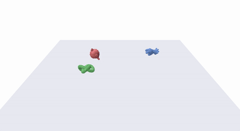</a></td>
<td width="25%"><a href="assets/MoviB_sample_7.mp4">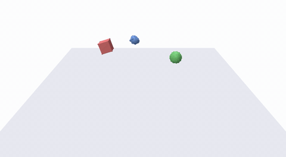</a></td>
<td width="25%"><a href="assets/MoviB_sample_8.mp4">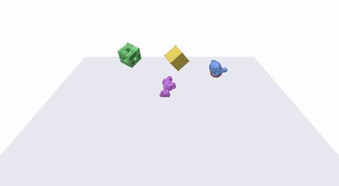</a></td>
</tr>
<tr>
<td width="25%"><a href="assets/MoviB_sample_9.mp4">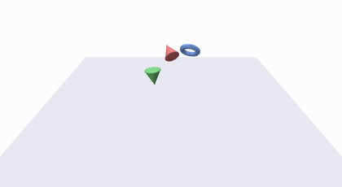</a></td>
<td width="25%"><a href="assets/MoviB_sample_10.mp4">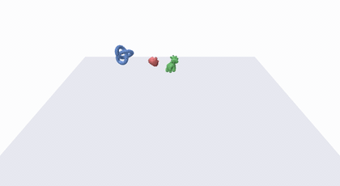</a></td>
<td width="25%"></td>
<td width="25%"></td>
</tr>
</table>

### Partial Point Cloud Observation

<table>
<tr>
<td width="25%"><a href="assets/PartialPC_sample_1.mp4">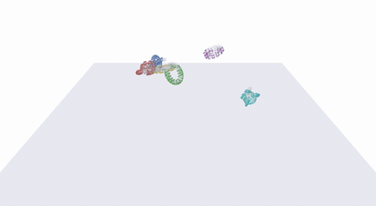</a></td>
<td width="25%"><a href="assets/PartialPC_sample_2.mp4">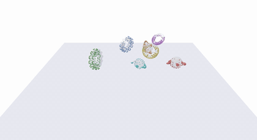</a></td>
<td width="25%"><a href="assets/PartialPC_sample_3.mp4">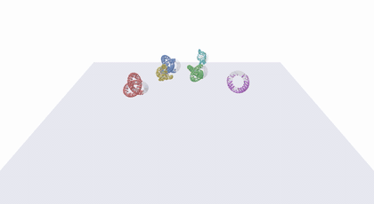</a></td>
<td width="25%"><a href="assets/PartialPC_sample_4.mp4">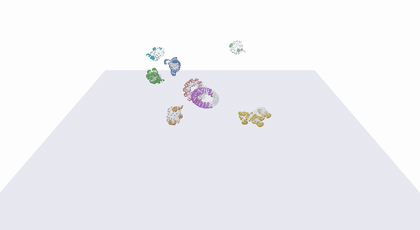</a></td>
</tr>
<tr>
<td width="25%"><a href="assets/PartialPC_sample_5.mp4">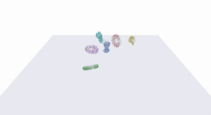</a></td>
<td width="25%"><a href="assets/PartialPC_sample_6.mp4">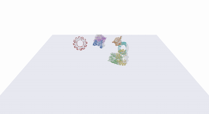</a></td>
<td width="25%"><a href="assets/PartialPC_sample_7.mp4">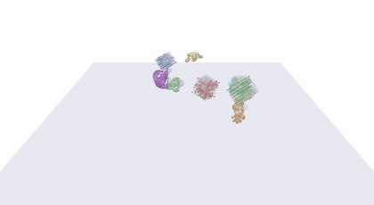</a></td>
<td width="25%"><a href="assets/PartialPC_sample_8.mp4">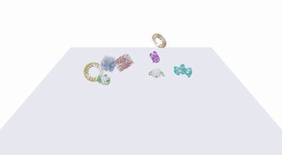</a></td>
</tr>
</table>

### From Rigid to Soft

> A learnable skinning module and physics-informed supervision turn sparse anchor dynamics into full-mesh deformation.

<table>
<tr>
<td width="25%"><a href="assets/Soft_Bodies_1.mp4">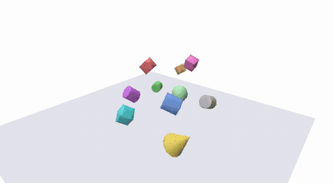</a></td>
<td width="25%"><a href="assets/Soft_Bodies_2.mp4">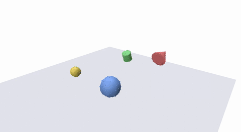</a></td>
<td width="25%"><a href="assets/Soft_Bodies_3.mp4">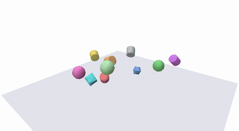</a></td>
<td width="25%"><a href="assets/Soft_Bodies_4.mp4">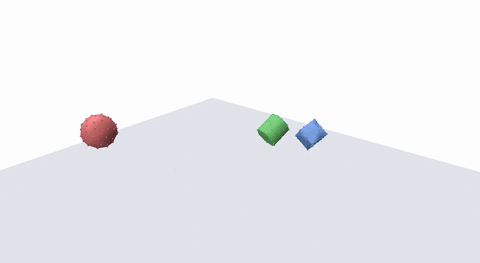</a></td>
</tr>
<tr>
<td width="25%"><a href="assets/Soft_Bodies_5.mp4">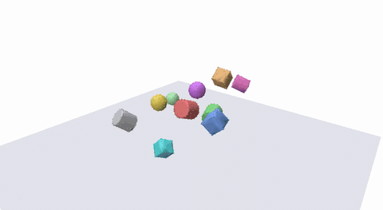</a></td>
<td width="25%"><a href="assets/Soft_Bodies_6.mp4">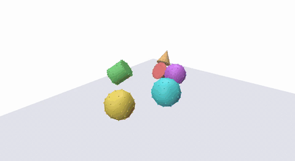</a></td>
<td width="25%"><a href="assets/Soft_Bodies_7.mp4">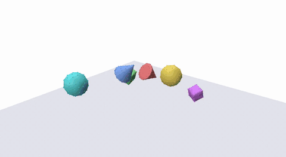</a></td>
<td width="25%"><a href="assets/Soft_Bodies_8.mp4">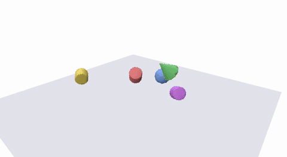</a></td>
</tr>
</table>

### Large Scale Simulation

<table>
<tr>
<td width="33%" align="center"><a href="assets/LargeScale_3x3x3.mp4">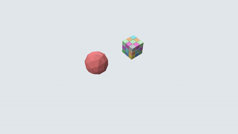</a> 3 &times; 3 &times; 3</td>
<td width="33%" align="center"><a href="assets/LargeScale_5x5x5.mp4">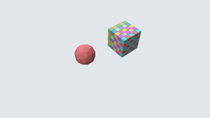</a> 5 &times; 5 &times; 5</td>
<td width="33%" align="center"><a href="assets/LargeScale_6x6x6.mp4">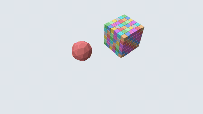</a> 6 &times; 6 &times; 6</td>
</tr>
</table>

### Controllable Articulated Body Simulation

<table>
<tr>
<td width="50%" align="center"><a href="assets/Controllable_ASE_sample_1.mp4">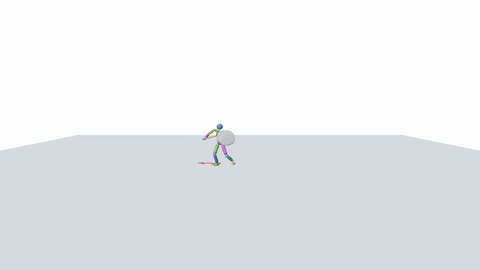</a> ASE Humanoid &mdash; Sample 1</td>
<td width="50%" align="center"><a href="assets/Controllable_ASE_sample_2.mp4">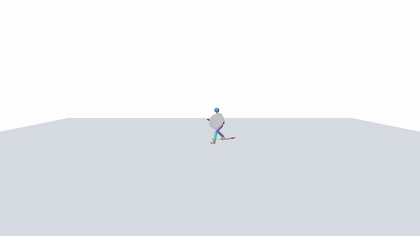</a> ASE Humanoid &mdash; Sample 2</td>
</tr>
<tr>
<td width="50%" align="center"><a href="assets/Controllable_ASE_sample_3.mp4">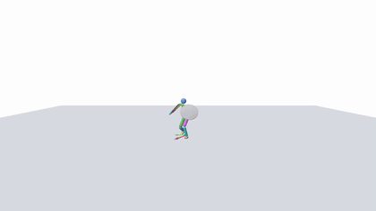</a> ASE Humanoid &mdash; Sample 3</td>
<td width="50%" align="center"><a href="assets/Controllable_G1_sample_1.mp4">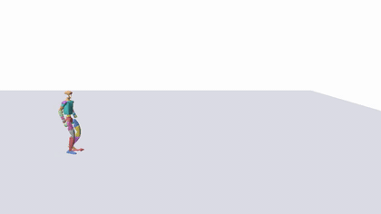</a> Unitree G1</td>
</tr>
</table>

For more results, please visit our [project page](https://people.csail.mit.edu/frankzydou/projects/RigidFormer/index.html).

---

## Code

Code release is coming soon. Please refer to the [project page](https://people.csail.mit.edu/frankzydou/projects/RigidFormer/index.html) for updates.
