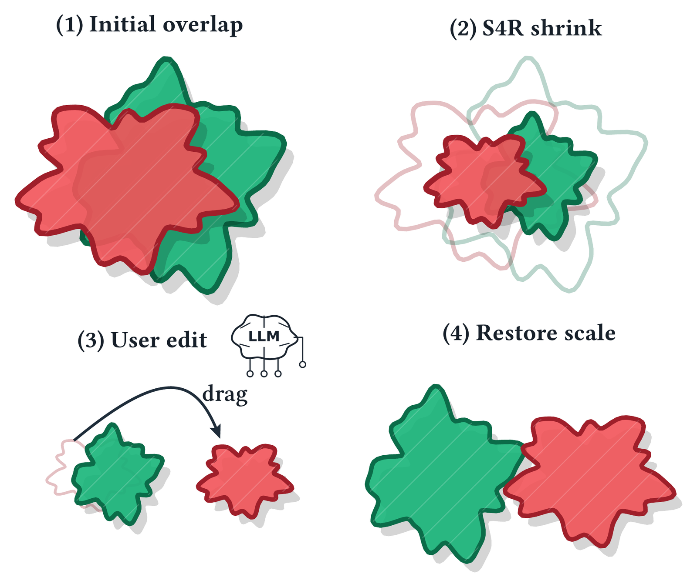
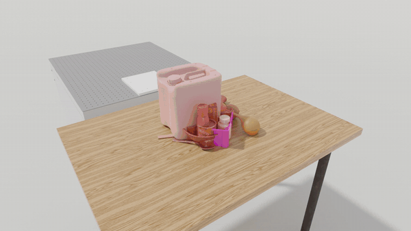
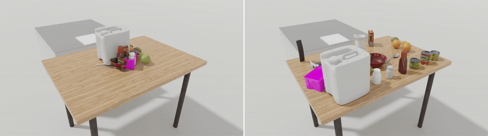
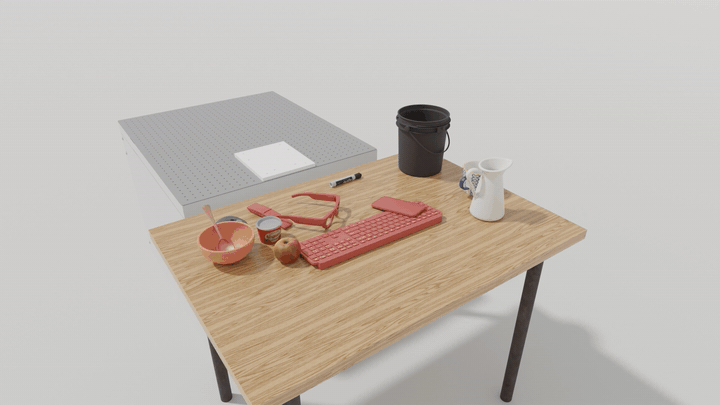
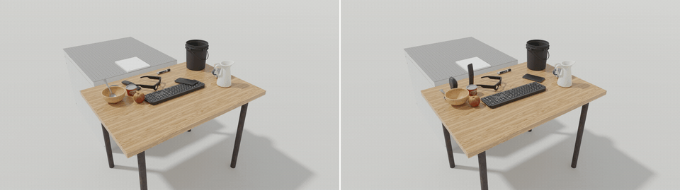
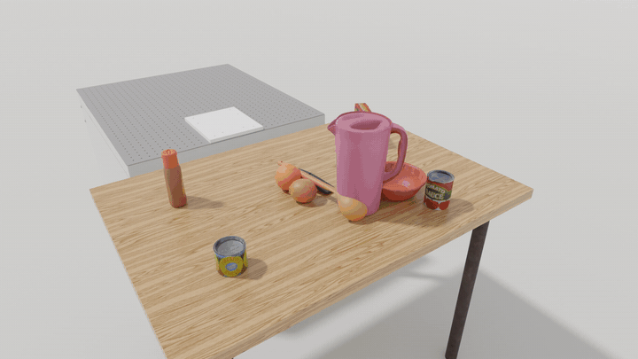
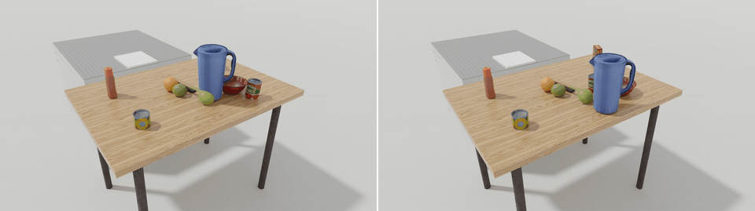
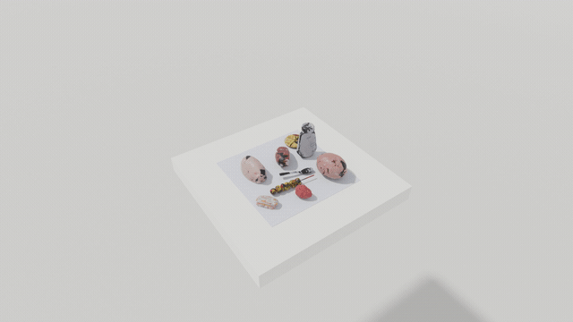
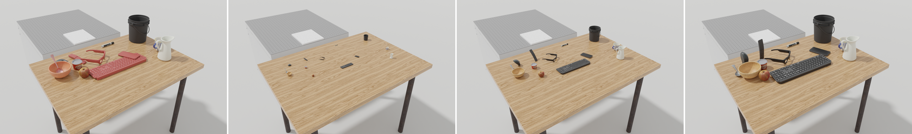
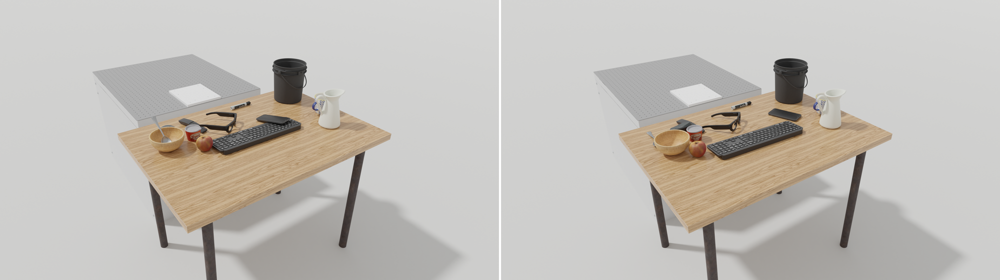

<div align="center">
<h1>SimReady Gate</h1>

**Language-driven, verifier-in-the-loop repair that turns generated tabletop scenes into penetration-free, simulation-ready ones**

*Part of [Dynamics-Modeling](https://github.com/Frank-ZY-Dou/Dynamics-Modeling), research code and projects by [Frank Zhiyang Dou](https://frank-zy-dou.github.io/) from [MIT CDFG](https://cdfg.mit.edu/).*

*Built on [S4R](../Penetration_Solving/) — Scaling for Rigid-Body Interpenetration Resolution, ACM Transactions on Graphics (SIGGRAPH Asia 2026).*

<a href="LICENSE"></a>
<a href="docs/DIAGNOSTIC_2026-09-08.md"></a>
<a href="../Penetration_Solving/"></a>

<table>
<tr>
<td></td>
</tr>
<tr>
<td><sub><b>Scale-space editing.</b> (1) Two bodies overlap. (2) S4R shrinks every body about its reference center until nothing touches. (3) The language model moves the shrunken bodies into the requested arrangement. (4) The scale is restored under the program, and the layout comes out penetration-free.</sub></td>
</tr>
<tr>
<td></td>
</tr>
<tr>
<td><sub><b>Twenty objects from a heap, laid out by language.</b> Twenty RoboLab catalog objects are dropped into a 13 cm radius on RoboLab's own table (80 object-object interpenetrating pairs). The request asks for a cooking layout: the bowl in front of the pitcher, the ladle and the spoon within reach, the fruit grouped on the left, the cans and bottles in a row at the back, the hammer, bin, remote and spatula out of the way on the right. S4R shrinks every body about its reference center; the model places the shrunken bodies; the scale is restored under the program, and the result is penetration-free with every predicate satisfied, in 28 s.</sub></td>
</tr>
<tr>
<td></td>
</tr>
<tr>
<td><sub><b>Settle as certification.</b> The heap and the repaired layout simulated in MuJoCo with CoACD proxies: the heap reaches 3.8 m/s and throws a body off the table; the repaired scene peaks at 0.84 m/s with nothing leaving the table. Every clip in this repository is rendered from the solver's own meshes with the assets' textures, without overlays.</sub></td>
</tr>
</table>
</div>

## 📢 Updates

* [September 2026] **Twenty-object demo.** A heap of twenty RoboLab objects laid out by a language request in scale-space, two recorded rounds of the agent loop, one passing certificate; the request, the programs, every tool output and both certificates are in [`docs/examples/pile_n20/`](docs/examples/pile_n20/) ([Example 2](#example-2-twenty-objects-from-a-heap-laid-out-by-language)).
* [September 2026] **Scale-space placement.** `place(a, x, y, yaw)` lets the model position bodies while every body is shrunk and nothing touches; the continuation restores full scale under the program. Renders from the solver's own meshes with the assets' textures (`viz/`).
* [September 2026] **Initial release**: the scene layer for RoboLab USD scenes (`usd-core`, no Isaac Sim) and RoboCasa MJCF objects (compiled by MuJoCo itself); the constraint language, its JSON schema and compiler; the S4R upright-on-plane repair driven by the program; the mesh-level evaluator with containment and resting-contact tests; the MuJoCo settle test; certificates with provenance; the agent skill and the Anthropic SDK backend; the diagnostics on RoboLab's 68 shipped scenes, on layouts from RoboLab's own placement solver, and on RoboCasa counter regions with RoboCasa's own placement test ([`docs/DIAGNOSTIC_2026-09-08.md`](docs/DIAGNOSTIC_2026-09-08.md)).

## Table of Contents

* [📢 Updates](#-updates)
* [Overview](#overview)
* [Demos](#demos)
   * [A scene RoboLab ships](#a-scene-robolab-ships) · [A layout RoboLab's solver rejects](#a-layout-robolabs-solver-rejects) · [A RoboCasa counter](#a-robocasa-counter)
* [Example 1: a scene RoboLab ships, one request, one certificate](#example-1-a-scene-robolab-ships-one-request-one-certificate)
   * [Summarize](#1-summarize-the-scene) · [Text to program](#2-text-to-program) · [Check](#3-check) · [Repair and write back](#4-repair-and-write-back) · [Settle](#5-settle-as-certification) · [Certificate](#6-the-certificate)
* [Example 2: twenty objects from a heap, laid out by language](#example-2-twenty-objects-from-a-heap-laid-out-by-language)
* [The agent loop](#the-agent-loop)
   * [Scale-space editing](#scale-space-editing)
* [The language](#the-language)
* [Getting started](#getting-started)
   * [Setup](#setup) · [Command line](#command-line) · [Assets](#assets)
* [Gates](#gates)
* [Results](#results)
* [Repository layout](#repository-layout)
* [Citation](#citation)
* [License](#license)

## Overview

Generated scenes reach a simulator with mesh-level interpenetration and with bodies that nothing
supports. SimReady Gate is the layer between a scene generator and the simulator:

- **Reads the scenes robotics pipelines actually produce.** RoboLab USD scenes (payloads, instance proxies, gprims, MDL materials) through `usd-core`, no Isaac Sim needed; RoboCasa / robosuite MJCF objects compiled by MuJoCo itself, so the geometry is exactly what the simulator collides with.
- **Measures interpenetration on the meshes, not on proxies.** An FCL evaluator with probed contact normals, a containment test and a resting-contact test: which pairs interpenetrate, which body sits inside another, which body nothing supports.
- **Repairs with S4R under a typed constraint program.** Bodies shrink about their reference center, grow back through minimum-norm QPs, stay upright on their support, and obey the program: regions, left/right/front/back relations, distances, soft target poses.
- **Lets a language model lay the scene out in scale-space.** At the shrunken scale nothing touches; the model places bodies into a semantic arrangement (`place`), and the continuation restores full scale while resolving what overlaps.
- **Certifies by settling.** The repaired scene is simulated in MuJoCo with the proxies an engine would use (convex hulls, CoACD pieces); peak speed, displacement and bodies that leave their support are measured against the program's own thresholds.
- **Leaves a certificate with provenance.** Program text and JSON, scene hash, git commit, library versions, every tolerance, every predicate value, the settle report.
- **Runs as an agent loop.** An agent following the skill in `skills/` (or the Anthropic SDK backend) writes and edits the program and acts on exit codes; it never overrides a number.

## Demos

### A scene RoboLab ships

<table>
<tr>
<td></td>
<td></td>
</tr>
<tr>
<td colspan="2"><sub><code>workdesk_snacks</code>, already physics-settled by RoboLab's pipeline, still has three object-object interpenetrations, the largest scoring 9.9 mm (keyboard against smartphone). One sentence of intent and one certificate later it is clean, with 3 cm of planar motion. Right: the same scene settled in MuJoCo, as shipped and after the repair. Walked through step by step in <a href="#example-1-a-scene-robolab-ships-one-request-one-certificate">Example 1</a>.</sub></td>
</tr>
</table>

### A layout RoboLab's solver rejects

<table>
<tr>
<td></td>
<td></td>
</tr>
<tr>
<td colspan="2"><sub>Ten catalog objects placed by RoboLab's own disc solver in its base scene; the solver reports failure and the layout carries seven interpenetrating pairs once seated. The gate repairs it to zero with the requested left/right/front/back relations kept. Right: settled in MuJoCo, the generated layout topples the pitcher and flips the bowl; the repaired one stays at rest.</sub></td>
</tr>
</table>

### A RoboCasa counter

<table>
<tr>
<td></td>
</tr>
<tr>
<td><sub>Ten AI-generated RoboCasa objects on a 0.3 x 0.3 m counter region. RoboCasa's own placement test (a separating-axis test on rotated bounding boxes) places nine and gives up on the tenth; the gate places all ten with overlaps allowed, and S4R packs them to zero penetration on the objects' V-HACD collision pieces in 2.6 s, under <code>within</code>, <code>on_support</code> and <code>upright</code>.</sub></td>
</tr>
</table>

## Example 1: a scene RoboLab ships, one request, one certificate

`workdesk_snacks.usda` is one of RoboLab's library scenes. It has been through RoboLab's physics
settle and still carries three object-object interpenetrations, the largest scoring 9.9 mm (keyboard and
smartphone). Below it goes through the gate with one sentence of intent.



*Left to right: the scene as shipped with the interpenetrating bodies tinted; S4R shrinking every
free body about its reference center and growing it back while the QP moves bodies in the plane;
the repaired scene.*

### 1. Summarize the scene

The agent reads this; it never looks at geometry itself.

```
$ python -m simready.cli summarize assets/scenes/workdesk_snacks.usda
- table: FIXED fixture,support; size 0.70x1.00x0.70 m; at (0.55, -0.00, -0.35); top rect x[0.20, 0.90] y[-0.50, 0.50] at z=0.003
- franka_table: FIXED fixture,support; size 0.90x0.76x0.79 m; at (-0.36, 0.00, -0.40); ...
- ceramic_mug: object; size 0.10x0.13x0.08 m; at (0.56, 0.40, 0.04)
- glasses: object; size 0.20x0.20x0.05 m; at (0.39, -0.10, 0.02)
- keyboard: object; size 0.14x0.43x0.02 m; at (0.57, 0.00, 0.01)
...
```

### 2. Text to program

The request was *"Keep everything on the table, the keyboard in front of the smartphone with at
least 5 cm between them, and nothing interpenetrating."* The model answers the prompt printed by
`python -m simready.cli prompt` with one JSON object (schema-constrained; each statement can carry the words that
justify it):

```json
{"statements": [
  {"op": "no_penetration", "margin": 0.005, "reason": "no interpenetration"},
  {"op": "fixed", "a": "table"}, {"op": "fixed", "a": "franka_table"}, {"op": "fixed", "a": "GroundPlane"},
  {"op": "on_support", "a": "*", "b": "table", "reason": "everything stays on the table"},
  {"op": "upright", "a": "*"},
  {"op": "within", "a": "*", "b": "table.top", "inset": 0.0},
  {"op": "in_front_of", "a": "keyboard", "b": "smartphone", "gap": 0.05, "reason": "keyboard in front of the phone, 5 cm"},
  {"op": "minimize"}],
 "gate": {"settle_v_max": 1.0, "settle_dx": 0.15},
 "assumptions": ["'in front of' read in RoboLab's frame: +x, away from the robot"]}
```

### 3. Check

`check` compiles the program exactly as the repair will; unknown bodies, self-relations and a
region with no room stop here with exit code 2.

```
$ python -m simready.cli check assets/scenes/workdesk_snacks.usda program.json
{"ok": true, "statements": 9, "rows": 27, "predicates": 40, ...}
```

### 4. Repair and write back

S4R runs on decimated proxies, verifies on the full meshes, checks every predicate, writes the
poses into a copy of the USD and reads it back:

```
$ python -m simready.cli repair assets/scenes/workdesk_snacks.usda program.json --out workdesk_repaired.usda
{"ok": true, "pen_before": 12, "pen_after": 0, "rmsd_xy": 0.032, "time_s": 46.6,
 "failed_predicates": [], "written_pose_error_m": 1.2e-06,
 "certificate": "workdesk_repaired.certificate.json"}
```

`pen_before` counts every negative pair, including the sub-millimeter resting contacts with the
table that PhysX leaves behind; three of the twelve are object-object.

### 5. Settle as certification

The repaired scene is simulated twice in MuJoCo, with the proxies a physics engine would use
(convex hulls, CoACD pieces); the thresholds come from the program's `gate` section:

```
$ python -m simready.cli settle workdesk_repaired.usda --program program.json
{"pass": true, "thresholds": {"v_max": 1.0, "d_max": 0.15, "source": "program gate"},
 "hull":  {"peak_speed": 0.805, "peak_disp": 0.1152, "left_support": [], "pass": true},
 "coacd": {"peak_speed": 0.816, "peak_disp": 0.1042, "left_support": [], "pass": true}}
```



### 6. The certificate

`workdesk_repaired.certificate.json` records the outcome with its provenance: the program text and
JSON, the scene hash, the git commit, library versions, every tolerance, the predicate values, the
settle report. A scene is "ready" only with this file.

## Example 2: twenty objects from a heap, laid out by language

Twenty catalog objects are dropped into a 13 cm radius on RoboLab's `table_oak` (seed 2 of
`viz/make_robolab_scene_video.py --pile`): 80 object-object interpenetrating pairs, 81 counting one contact with the table. The request:

> *Twenty things were dumped in a heap on the kitchen table. Lay them out for cooking: the bowl in
> front of the pitcher, the ladle and the big spoon within reach of the bowl, the fruit (both
> oranges, the lime, the lemon) grouped together on the left, the cans and bottles in a row at the
> back, the hammer, the bin, the remote and the spatula out of the way on the right. Everything
> upright on the table, at least 2 cm from the edge, nothing interpenetrating, and do not move
> anything further than necessary.*

The model's program has 46 statements: the usual guards, one `place` target per object chosen
from the table rectangle and the object sizes (the placement step in scale-space), and the
relations that make the request checkable:

```json
{"op": "place", "a": "bowl", "x": 0.62, "y": 0.00, "reason": "bowl in front (+x) of the pitcher"},
{"op": "place", "a": "orange_02", "x": 0.48, "y": 0.34, "reason": "fruit group on the left (+y)"},
{"op": "place", "a": "pineapple_slices_can", "x": 0.80, "y": 0.42, "reason": "cans and bottles in a row at the back (+x)"},
{"op": "in_front_of", "a": "bowl", "b": "pitcher", "gap": 0.12},
{"op": "near", "a": "ladle", "b": "bowl", "r": 0.22},
{"op": "left_of", "a": "orange_02", "b": "bowl", "gap": 0.18},
{"op": "right_of", "a": "hammer_8", "b": "bowl", "gap": 0.22},
...
"gate": {"settle_v_max": 1.0, "settle_dx": 0.15}
```

Two rounds of the loop, both from the tools' own outputs (`viz/run_agent_rounds.sh`; the request,
the programs, every tool output and both certificates are in
[`docs/examples/pile_n20/`](docs/examples/pile_n20/)):

| round | repair | outcome | settle (hull / CoACD) |
|---|---|---|---|
| 1 | 81 → 0 pairs, planar RMSD 0.333 m, 24 s | `place(hammer_8)` missed by 7.3 cm: the 33 cm hammer does not fit at the requested corner next to the bin | 0.89 / 0.99 m/s, pass |
| 2 | 81 → 0 pairs, planar RMSD 0.328 m, 28 s | the exact hammer target dropped (the request only asks for it out of the way on the right, which `right_of` states); every predicate holds | 0.86 / 0.84 m/s, pass |

The heap itself, settled as is, reaches 4.9 m/s with ten bodies off the table (hull proxies) and
3.8 m/s with one (CoACD). The continuation here starts at s = 0.3, large enough to see the bodies
while they are placed; the certificate records the value.

## The agent loop

The agent is a coding agent that follows [`skills/simready-scenegen/SKILL.md`](skills/simready-scenegen/SKILL.md),
or the SDK backend in `simready/dsl/text2dsl.py` (Claude with schema-constrained output). It

1. reads `summarize`, writes the program from the request, and validates it with `check`;
2. runs `repair --out` and reads the JSON: `pen_after`, `failed_predicates`, `rmsd_xy`;
3. acts on the outcome, for at most three rounds: `pen_after > 0` means the intent is too tight (fewer
   objects, a larger region); a failed relation means a gap to relax; a body in `left_support` after
   `settle` gets a `within(..., inset=)` statement;
4. reports the certificate path, and nothing else counts as "ready".

It never overrides a number, and final poses are not something it types by hand: a body is placed
through relations, regions and `place` targets, and S4R decides what is feasible.

### Scale-space editing

S4R makes a scene an editable scale-space: once every body is shrunk about its reference center,
nothing touches, and a body can be moved anywhere. `place(a, x, y, yaw)` is that move, issued by
the model from its understanding of the request; restoring the scale then resolves whatever still
overlaps, with the target kept as a soft pull. The pipeline is shrink, arrange, restore.

## The language

```
program
  no_penetration(*, margin=0.01)
  fixed(table)   on_support(*, table)   upright(*)
  within(*, table.top, inset=0.02)
  place(bowl, x=0.62, y=0.00)            # a target pose in the shrunken scale-space (soft)
  in_front_of(bowl, pitcher, gap=0.12)   # a.x >= b.x + gap in RoboLab's frame (front = +x, left = +y)
  near(ladle, bowl, r=0.22)   left_of(orange_02, bowl, gap=0.18)   right_of(hammer_8, bowl, gap=0.22)
  minimize displacement(*)
gate
  G5: v_max <= 1.0, dx <= 0.15
```

| statement | compiles to |
|---|---|
| `minimize displacement(*)` / `prefer(a, w)` | the QP objective: minimum-norm step, plus a pull toward a pose |
| `no_penetration(*, margin)` | the clearance of every contact row S4R generates from FCL |
| `on_support(a, B)`, `upright(a)` | a's lowest point on B's surface, roll/pitch to zero (removed from the QP variables) |
| `within(a, R)`, `inside(a, C)` | per-step rectangle rows on a's exact projected footprint |
| `left_of / right_of / in_front_of / behind (a, b, gap)`, `min_distance / near (a, b, r)` | linear rows on the reference centers |
| `place(a, x, y, yaw)` | a's pose at the shrunken scale, and a soft pull while the scale is restored |
| `gate` | thresholds for the verifier and the settle test, not the QP |

Every statement also becomes a predicate that the final scene is checked against, and a line of
the certificate.

## Getting started

### Setup

```
pip install numpy scipy trimesh python-fcl osqp mujoco coacd usd-core   # Python 3.10+
```

Optional: `anthropic` for the SDK backend, which reads `ANTHROPIC_API_KEY` from the environment
only (nothing in this repository holds a credential, and `.env` files are ignored); Blender 3.6
for the renders in `viz/` (`BLENDER=/path/to/blender`).

### Command line

| command | does | exit 0 means |
|---|---|---|
| `python -m simready.cli summarize <scene>` | body list, sizes, tags, support rectangles | — |
| `python -m simready.cli prompt <scene> --request "..."` | the text-to-program prompt with the schema | — |
| `python -m simready.cli check <scene> program.json` | validate, parse and compile the program | the program is usable |
| `python -m simready.cli verify <scene>` | the mesh-level evaluator on the scene as is | no penetrating pair |
| `python -m simready.cli repair <scene> program.json --out <file>` | S4R under the program, full-mesh verification, write-back, certificate | pen 0 and every predicate holds |
| `python -m simready.cli settle <scene> --program program.json` | the MuJoCo settle test, thresholds from the program's gate | the scene stays at rest |

Scenes are RoboLab `.usda` files or layout JSONs (`base_scene` + objects); RoboCasa objects come
in through `simready.io.mjcf_io` (see `experiments/robocasa_capacity.py`).

### Assets

RoboLab and RoboCasa assets are not redistributed here. The experiments and the video drivers read
them from their own checkouts: set `ROBOLAB_DIR` to a checkout of
[NVLabs/RoboLab](https://github.com/NVLabs/RoboLab) (with its LFS assets pulled) and
`ROBOCASA_AIGEN_DIR` to RoboCasa's `aigen_objs` folder.

## Gates

| gate | question | tool |
|---|---|---|
| G0 | is the asset admissible: closed visual mesh, more than one collision piece, proxy that matches the visual? | `mjcf_object_stats` |
| G2 | does any pair interpenetrate, is any body inside another, is any body unsupported? | FCL score with probed normals, containment and resting-contact tests (`simready.gates.verify`) |
| G3 | the repair: S4R scale continuation under the program | `simready.repair.upright_s4r` |
| G5 | does the scene stay at rest in a physics engine? | MuJoCo settle with hull and CoACD proxies (`python -m simready.cli settle`) |

## Results

Measured on RoboLab's 68 shipped scenes, on pre-settle layouts from RoboLab's own placement
solver staged in its base scene, and on RoboCasa counter regions with RoboCasa's own placement
test; every table is backed by a tracked file under `results/`.

- **RoboLab library**: object-object mesh penetration in 26 / 68 scenes (12 at or above 1 mm), a
  body wholly inside another in 4, a body nothing supports in 30.
- **RoboLab pre-settle layouts** (N = 4–10, 3 seeds): the disc solver accepts 5 / 12 and those are
  clean; the 7 it rejects carry 1–7 penetrating pairs, and S4R repairs all 7 to zero with the
  requested relations kept (planar RMSD 0.03–0.17 m, 4–17 s per cell).
- **Settle** (MuJoCo, identical harness): median peak speed 1.0 → 0.4 m/s from the seated raw
  layouts to the repaired ones; no repaired cell loses a body, and what remains is one tall remote
  control toppling, present before the repair as well.
- **RoboCasa** (own placement test, 5 seeds): the box test is conservative and reliable; it gives
  up in a 0.3 m square at 8–12 objects (4/5, 1/5, 0/5), where the gate places every object (5/5).

Full tables and the fixes behind them:
[`docs/DIAGNOSTIC_2026-09-08.md`](docs/DIAGNOSTIC_2026-09-08.md). Design note: [`docs/design.html`](docs/design.html).

## Repository layout

```
simready/            the library
  scene/             Body, Scene, mesh proxies, surface-based seating
  gates/             verify.py (G2)  settle_mujoco.py (G5)
  repair/            upright_s4r.py: S4R upright-on-plane continuation with program rows
  dsl/               model.py (parser)  schema.py (JSON schema, prompt)  compile.py  text2dsl.py  anthropic_backend.py
  io/                usd_io.py (RoboLab USD read/write)  mjcf_io.py (RoboCasa MJCF via MuJoCo)
  cli.py             summarize | prompt | check | verify | repair | settle
skills/              the agent skill that runs the loop
experiments/         the diagnostics behind docs/DIAGNOSTIC_2026-09-08.md (RoboLab, RoboCasa, settle)
viz/                 Blender rendering on the solver's meshes, video drivers, the agent-run page generator
results/             tracked result tables and the persisted layouts
docs/                diagnostic notes, design note, media, the recorded example runs
```

## Citation

SimReady Gate builds on S4R; please cite both.

```bibtex
@article{dou2026s4r,
  title   = {S4R: Scaling for Rigid-Body Interpenetration Resolution},
  author  = {Dou, Zhiyang and Zhao, Ang and Peng, Chen and Guo, Minghao and
             Wu, Haixu and Lin, Cheng and Liu, Yuan and Yao, Junfeng and
             Guo, Xiaohu and Wang, Wenping and Matusik, Wojciech},
  journal = {ACM Transactions on Graphics (SIGGRAPH Asia)},
  year    = {2026},
}

@misc{dou2026simreadygate,
  title        = {SimReady Gate: Language-Driven, Verifier-in-the-Loop Repair of Generated Scenes},
  author       = {Dou, Zhiyang and Matusik, Wojciech},
  year         = {2026},
  howpublished = {\url{https://github.com/Frank-ZY-Dou/Dynamics-Modeling/tree/main/SimReady_Gate}},
  note         = {Part of Dynamics-Modeling},
}
```

## License

MIT. RoboLab and RoboCasa assets are not redistributed here; the experiments read them from
their own checkouts (`ROBOLAB_DIR`, `ROBOCASA_AIGEN_DIR`).
